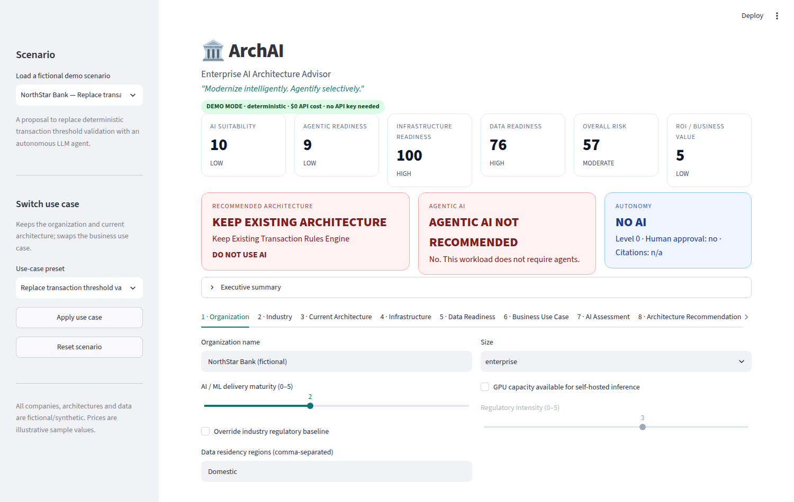
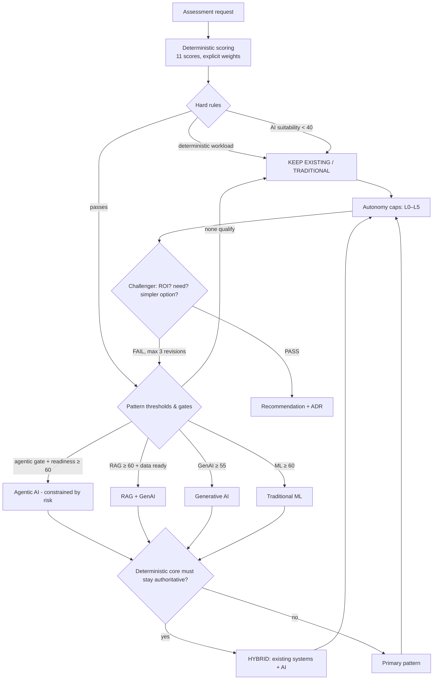
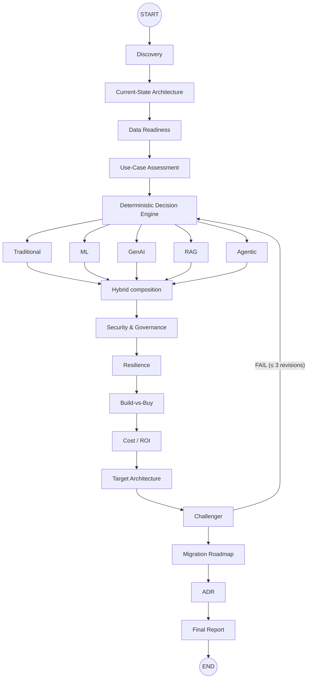
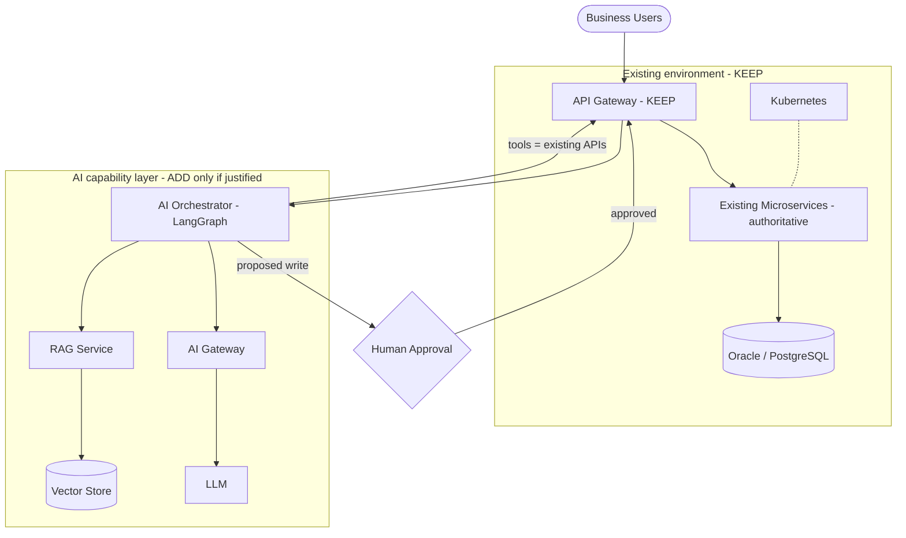
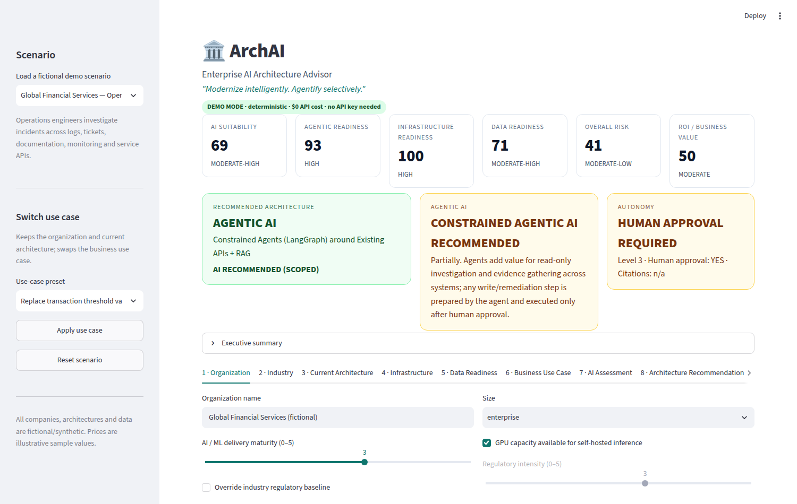
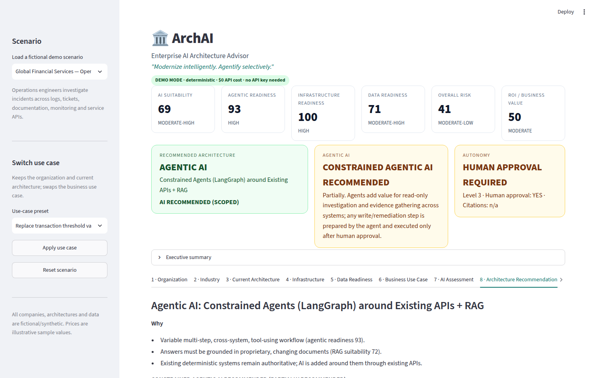
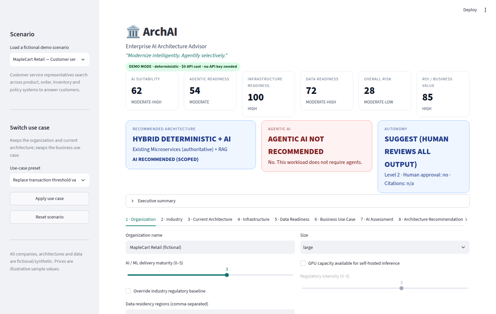
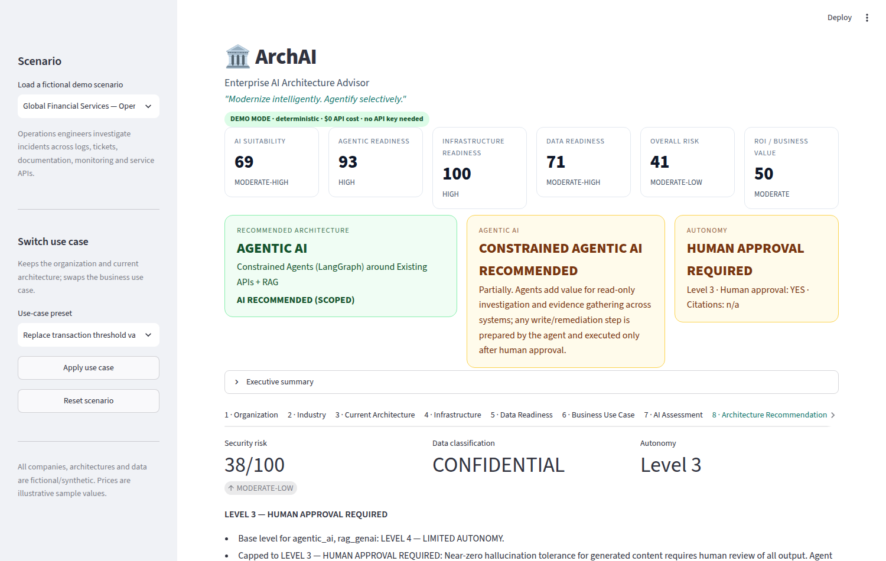
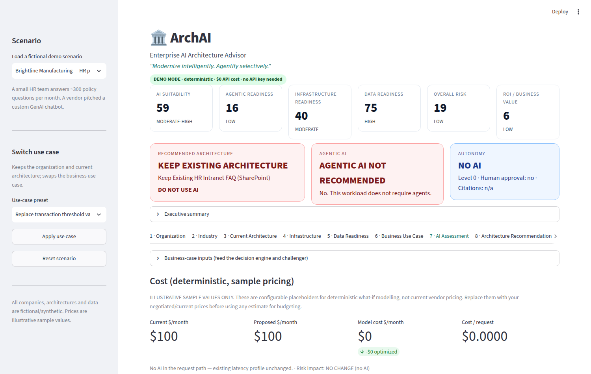
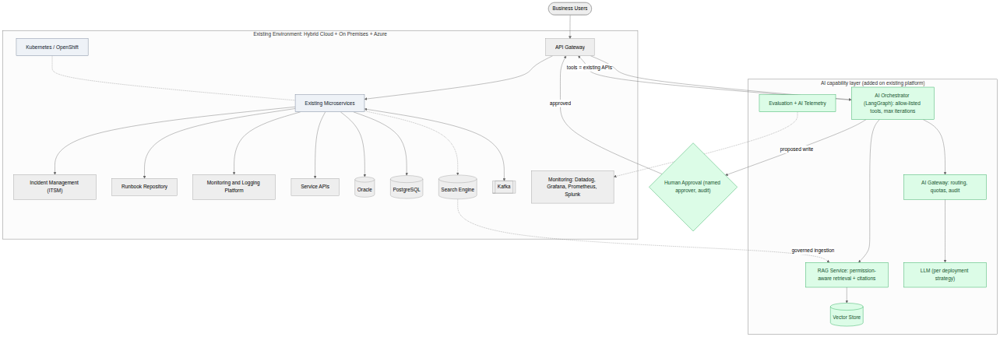

# ArchAI

**Enterprise AI Architecture Advisor**

> *"Modernize intelligently. Agentify selectively."*

ArchAI helps an enterprise answer two questions in order:

1. **Do we actually need AI for this business problem?**
2. If yes: **what is the simplest, safest, most cost-effective architecture that fits the environment we already run?**

It uses a **deterministic Python decision engine** (explicit rules, weighted scoring and thresholds), orchestrated as a **LangGraph** workflow, with a **FastAPI** service and a **Streamlit** executive UI. Its main feature is that it can say **"DO NOT USE AI"**, **"AGENTIC AI NOT RECOMMENDED"** and **"ROI DOES NOT JUSTIFY AI"**, and back each one with an explanation.

> ⚠️ **All companies, architectures and data in this repository are fictional and synthetic.** NorthStar Bank, MapleCart Retail, Sterling Legal LLP, Global Financial Services and Brightline Manufacturing are invented for the demo. Model prices are **illustrative sample values** that you can configure. They are not current vendor pricing.



---

## Contents
[Problem](#problem) · [Why I Built This](#why-i-built-this) · [Core Philosophy](#core-philosophy) · [Why Not Every Company Needs Agentic AI](#why-not-every-company-needs-agentic-ai) · [Architecture Decision Framework](#architecture-decision-framework) · [Traditional vs ML vs GenAI vs RAG vs Agentic vs Hybrid](#traditional-vs-ml-vs-genai-vs-rag-vs-agentic-vs-hybrid) · [Current-State Assessment](#current-state-architecture-assessment) · [Kubernetes & Microservices](#kubernetes--microservices) · [On-Prem / Cloud / Hybrid](#on-prem--cloud--hybrid) · [Security](#security) · [Governance](#governance) · [Data Readiness](#data-readiness) · [Build vs Buy](#build-vs-buy) · [Model Deployment](#model-deployment-strategy) · [Resilience](#resilience) · [Cost Optimization](#cost-optimization) · [ROI](#roi) · [Evaluation](#evaluation) · [Migration Roadmap](#migration-roadmap) · [ADRs](#architecture-decision-records) · [Demo Scenarios](#demo-scenarios) · [Installation](#installation) · [Demo Mode](#demo-mode) · [Live AI Mode](#live-ai-mode) · [Docker](#docker) · [Tests](#tests) · [Screenshots](#screenshots) · [Limitations](#limitations) · [Future Roadmap](#future-roadmap)

---

## Problem

Many enterprise AI programs start from *"Which LLM should we use?"* or *"Let's build agents."* That skips the questions an experienced architect asks first:

- Is the workload deterministic? Would a rules engine already solve it, more cheaply and with a full audit trail?
- Is this really a prediction problem, where a classical ML model is better than an LLM?
- Do the answers have to be grounded in proprietary documents with citations?
- Does the workflow actually change from case to case across several systems, or would a workflow engine handle it?
- What does the company **already run**, such as Kubernetes, microservices, an API gateway, identity and observability? Can AI fit around those systems instead of replacing them?
- What happens when the AI fails?
- Does the ROI justify the complexity?

## Why I Built This

I wanted a portfolio project that shows **architectural judgment** rather than LLM generation. The most valuable recommendation an architect can make is often *"don't"*: keep the deterministic rules engine, use classical ML, or add a narrow RAG service around existing APIs instead of agents everywhere. ArchAI turns that judgment into explicit, testable code.

## Core Philosophy

ArchAI reasons in the order an enterprise architect would:

```
BUSINESS PROBLEM → CURRENT ARCHITECTURE → DATA → SECURITY / REGULATION → OPERATIONAL CONSTRAINTS
→ AI SUITABILITY → ARCHITECTURE OPTIONS → RISK → COST → ROI → TARGET ARCHITECTURE → MIGRATION ROADMAP
```

- **AI is never assumed.** AI, GenAI, RAG, agents, LangGraph and cloud migration all have to earn their place.
- **AI fits around existing architecture.** Existing deterministic systems remain authoritative. `REPLACE` is only produced for components the organization has already flagged as end-of-life.
- **LLMs explain; they never decide.** Every score, verdict, cost and autonomy level comes from deterministic Python.
- **Conservative autonomy.** Regulated and high-risk workloads default to human approval.
- **AI failure must not take down a deterministic business process.**

## Why Not Every Company Needs Agentic AI

Agents add nondeterminism, hallucination risk, latency, operational complexity, governance burden and cost. ArchAI only considers agents when an **agentic need gate** passes. At least **3 of 4** of these must be rated ≥ 3/5:

`multi-step reasoning` · `workflow variability` · `cross-system interaction` · `tool requirements`

Even then:

- **Deterministic workloads** multiply agentic readiness by 0.4.
- **Deterministic-only actions** (money movement, payment authorization, regulatory calculations, transaction validation, authentication, authorization, compliance rules) cap agentic readiness at 20. Those actions are always executed by existing deterministic systems.
- Agents that are recommended in regulated or write-capable contexts are **constrained**: read-only tools by default, and every write goes through a human approval gate.

**Example (scenario 1).** NorthStar Bank wants to replace deterministic transaction-threshold validation with an autonomous LLM agent. ArchAI returns **AGENTIC AI NOT RECOMMENDED · KEEP EXISTING RULES ENGINE · DO NOT USE AI**, because the workload is deterministic, transaction-sensitive, auditable and governed by explicit rules.

## Architecture Decision Framework



**Scores (0–100, all deterministic):** AI Suitability · ML Suitability · GenAI Suitability · RAG Suitability · Agentic AI Readiness · Infrastructure Readiness · Data Readiness · Security Risk · Operational Risk · Overall Risk · ROI / Business Value.

Each score includes a factor breakdown and its gate or penalty adjustments, so you can see exactly why a number is what it is. All weights and thresholds are in [`app/decision_engine/weights.py`](app/decision_engine/weights.py). See also [docs/DECISION_FRAMEWORK.md](docs/DECISION_FRAMEWORK.md).

### LangGraph workflow



The challenger loop is bounded twice: by an `AgentBudget` (max 3 revisions) and by LangGraph's `recursion_limit`. `GET /workflow/mermaid` returns the compiled graph.

## Traditional vs ML vs GenAI vs RAG vs Agentic vs Hybrid

| Option | Recommended when | ArchAI rule |
|---|---|---|
| **Keep existing** | A working deterministic solution exists and AI adds no value | Deterministic workload, low AI suitability, or ROI fails |
| **Traditional software** | Rules are deterministic, the workflow is predictable and auditability is critical | Same rules as above, but with no existing solution |
| **Traditional ML** | Prediction, classification, anomaly detection, forecasting or ranking | ML suitability ≥ 60 (prediction need ≥ 2) |
| **Generative AI** | Summarization, extraction, generation or conversation | GenAI suitability ≥ 55 |
| **RAG + GenAI** | Proprietary, changing knowledge, document grounding, citations | RAG ≥ 60 **and** data-readiness prerequisites are met |
| **Agentic AI** | Multi-step, variable, cross-system, tool-using workflows | Need gate met, readiness ≥ 60, not deterministic |
| **Hybrid** | Deterministic systems stay authoritative and AI improves selected steps | Deterministic core, deterministic-only actions, cross-system lookups, or ML + GenAI together |

## Current-State Architecture Assessment

ArchAI models what the enterprise **already has**:

- deployment (on-prem, AWS, Azure, GCP, private, hybrid, multi-cloud)
- compute (Kubernetes, OpenShift, Docker, VMs, bare metal, serverless)
- architecture style (monolith, SOA, microservices, event-driven, API-based, batch)
- integration (REST, GraphQL, gRPC, Kafka, MQ, event bus, batch, files, DB, legacy, MCP)
- identity and security (AD, Entra ID, OAuth 2.0, OIDC, JWT, RBAC, ABAC, API gateway, service accounts, secrets, private networking)
- data (PostgreSQL, Oracle, SQL Server, MySQL, MongoDB, lake, warehouse, object storage, SharePoint, document repositories, vector DBs, search)
- DevOps (Jenkins, GitHub Actions, GitLab CI, Azure DevOps, ArgoCD, Prometheus, Grafana, Splunk, CloudWatch, Datadog)

The **Infrastructure Readiness** score (0–100) weights container platform 20, service architecture 15, identity and access 15, API gateway 10, secrets 10, CI/CD 10, observability 10, private networking 5 and integration fabric 5.

## Kubernetes & Microservices

Existing Kubernetes or OpenShift is **always KEEP**, and AI services deploy on it as ordinary workloads. Existing microservices are **KEEP and authoritative**. AI reaches them through their APIs and the existing API gateway. It never connects directly to databases of record, and it never replaces services.



## On-Prem / Cloud / Hybrid

Deployment shapes several outputs. It drives the **model deployment strategy**: commercial API, managed model in your tenancy, self-hosted open-weight, on-prem inference, or hybrid routing. It also affects the **build-vs-buy** fit. ArchAI never recommends a cloud migration just to adopt AI, so the deployment row in the matrix is always `KEEP`.

## Security

- **Security Risk score:** an industry baseline, plus PII, financial data, confidentiality, legal privilege, residency, regulatory intensity, customer exposure, high-risk writes and deterministic-only actions, minus existing mitigations (RBAC/ABAC, secrets management, private networking, API gateway).
- **Controls catalogue**, rated MUST / SHOULD / COULD: identity propagation, least privilege, secrets, permission-aware retrieval, prompt-injection defenses, DLP, audit, residency, model risk, ethical walls.
- **Agent failure modes** checked: direct and indirect prompt injection, excessive agency, unauthorized tool execution, hallucinated parameters, infinite loops, runaway tokens, poisoned RAG content, exfiltration, cross-user leakage, privilege escalation, malicious documents, tool failure.
- **Working guardrail primitives** in [`app/security/agent_guardrails.py`](app/security/agent_guardrails.py): iteration and token budgets, timeouts, a tool allow-list, Pydantic schema validation of tool parameters, approval-required tools, and screening of retrieved content for indirect injection. ArchAI's own LangGraph loop uses `AgentBudget`.

## Governance

Human-in-the-loop autonomy levels:

| Level | Meaning |
|---|---|
| 0 | No AI |
| 1 | Read only: AI retrieves and analyzes |
| 2 | Suggest: AI recommends, a human reviews all output |
| 3 | Approval required: AI prepares the action, a human approves execution |
| 4 | Limited autonomy: low-risk actions within strict policy |
| 5 | Autonomous: only bounded, low-risk, non-regulated workloads |

Autonomy starts from what the architecture can technically do and is **capped** by risk:

- mandatory review (legal work, near-zero hallucination tolerance) → L2
- high-risk writes → L3
- regulated industry or regulatory intensity ≥ 4 → L3
- security risk ≥ 60 → L3
- L5 → only for low-risk, bounded, non-regulated workloads

Each action type also gets its own **execution policy**. For example, `money_movement` is handled by the "existing deterministic system", and `production_remediation` follows "AI prepares, a named human approves, the existing system executes".

## Data Readiness

The data readiness score weights availability, quality, freshness, ownership, lineage, metadata, permissions and document quality. Recommending RAG also requires document quality ≥ 2, a defined permissions model and readiness ≥ 40. **A vector database being present contributes 0 points**, because tooling is never a reason to add RAG.

## Build vs Buy

ArchAI scores seven sourcing options: keep existing, build internally, managed AI platform, cloud-managed AI, open-source platform, commercial SaaS, and hybrid. The result is a **KEEP / BUILD / BUY / HYBRID** decision with reasoning. Custom LangGraph builds are never the default. When agents are justified, ArchAI recommends building *only* a thin orchestration layer around existing APIs.

## Model Deployment Strategy

ArchAI evaluates five strategies: commercial LLM API, managed cloud model, self-hosted open-weight, on-prem inference, and hybrid. The inputs are confidentiality, privilege, residency, GPU availability, cloud footprint, volume and operational burden. For example, privileged legal data with no GPU capacity produces *"do not default to a public API — a decision for legal/security."*

## Resilience

*AI failure must not unnecessarily bring down an existing deterministic business process.*

ArchAI produces a graceful degradation chain:

```
AI fully available → vector store down: keyword search → primary model down: fallback model
→ all models down: disable AI assistance → existing system continues operating
```

It also provides failure scenarios for provider, vector store, tool, budget and network outages. The default patterns are timeouts, max 3 retries with backoff (1s/2s/4s), circuit breakers, a fallback model, a feature-flag kill switch, and HA replicas. A working `RetryPolicy` and `CircuitBreaker` are in [`app/resilience/patterns.py`](app/resilience/patterns.py), and the live LLM client uses them.

## Cost Optimization

Cost is pure arithmetic over the inputs and [`config/model_pricing.json`](config/model_pricing.json), which contains **sample** tiers. The engine calculates:

- requests/month
- effective input tokens, including RAG top-k × chunk size
- output tokens, with response caps applied
- cached vs uncached input
- smaller-model routing
- batch discounts
- LLM calls per request (agents make several)
- infrastructure and human-review cost
- current vs proposed monthly cost
- savings from optimization compared with an unoptimized baseline

It also compares the cost of every architecture option on the same inputs.

The **What-If Simulator** (Cost & ROI tab, or `POST /cost/simulate`) lets you adjust requests, tokens, top-k, cache hit rate, small-model routing, human review and infrastructure cost. It shows current cost, proposed cost, potential savings, latency impact and risk impact.

## ROI

The business case covers:

- annual current operating cost (manual effort + errors/rework + existing technology)
- estimated annual benefit
- AI operating cost (taken from the cost engine)
- implementation cost
- net annual benefit
- payback period
- 3-year ROI

**"ROI DOES NOT JUSTIFY AI"** is a first-class outcome. It applies when the net benefit is ≤ 0 or payback exceeds 36 months. When it happens, the challenger revises the decision. Scenario 8 shows this: a low-volume HR chatbot ends at **KEEP EXISTING HR INTRANET FAQ**.

## Evaluation

ArchAI produces acceptance criteria for each architecture type before production:

- retrieval precision and recall
- groundedness
- answer correctness
- hallucination rate
- citation accuracy
- tool-call success
- task completion
- guardrail breaches
- latency, cost per request, human override rate, error rate and availability

The targets are **recommended starting thresholds** that you calibrate against your own baseline. They are not claims about any system.

## Migration Roadmap

| Phase | Description |
|---|---|
| 0 | Validate business case |
| 1 | POC (read-only) |
| 2 | Controlled pilot (suggest) |
| 3 | Human-in-the-loop production (approval) |
| 4 | Limited automation, only if the autonomy ceiling allows it |
| 5 | Scale only if KPIs justify it |

Autonomy ceilings never decrease from one phase to the next and never reach unrestricted autonomy for high-risk workloads. A no-AI decision produces only Phase 0, plus deterministic improvements.

## Architecture Decision Records

Every assessment produces an ADR with these sections:

- title, business problem, current architecture, constraints, assumptions
- scores, alternatives considered, decision and reasons, triggered rules
- rejected alternatives, transformation matrix, target architecture
- security, cost, risks, challenger review
- migration approach, evaluation criteria, conditions requiring reassessment

You can export it as Markdown from the ADR tab or with `POST /assessment/adr`.

## Demo Scenarios

| Scenario (fictional) | Recommendation | Agentic AI | Autonomy | Business case |
|---|---|---|---|---|
| NorthStar Bank — Replace transaction rules with autonomous agents | **Keep Existing** — Transaction Rules Engine | NOT RECOMMENDED | L0 | ROI does not justify AI |
| NorthStar Bank — Policy & procedure knowledge assistant | **RAG + GenAI** (citations + human review) | NOT RECOMMENDED | L2 | Justified |
| MapleCart Retail — Customer service cross-system search | **Hybrid** — Existing Microservices (authoritative) + RAG | NOT RECOMMENDED | L2 | Justified |
| Sterling Legal LLP — Secure case research assistant | **Secure RAG + GenAI** (citations + lawyer review mandatory) | NOT RECOMMENDED | L2 | Justified |
| Global Financial Services — Operations incident investigation | **Constrained Agents (LangGraph) around Existing APIs + RAG** | CONSTRAINED | L3 approval | Justified |
| MapleCart Retail — Store demand forecasting (vector DB exists!) | **Traditional ML**, no RAG | NOT RECOMMENDED | L2 | Justified |
| NorthStar Bank — Cross-system incident investigation | **Constrained Agents around Existing APIs + RAG** | CONSTRAINED | L3 approval | Justified |
| Brightline Manufacturing — HR policy chatbot (low volume) | **Keep Existing** — HR Intranet FAQ | NOT RECOMMENDED | L0 | **ROI does not justify AI** |

Scenario files live in [`scenarios/`](scenarios/). The UI supports deep links such as `http://localhost:8501/?scenario=legal-research`.

## Installation

Requires Python 3.11+.

```bash
cd archai-enterprise-advisor
python -m venv .venv && source .venv/bin/activate
pip install -r requirements-dev.txt          # core + pytest/httpx/ruff
cp .env.example .env                          # optional; DEMO_MODE=true by default

streamlit run frontend/streamlit_app.py       # UI  → http://localhost:8501
uvicorn app.api.main:app --reload --port 8000 # API → http://localhost:8000/docs
```

API endpoints:

| Method | Path | Purpose |
|---|---|---|
| GET | `/health` | Status, mode, `live_ai_available` (boolean only) |
| POST | `/assessment` | Full assessment |
| POST | `/assessment/adr` | ADR as Markdown |
| POST | `/architecture/recommend` | Decision, matrix, target architecture |
| POST | `/cost/simulate` | What-if cost simulation |
| POST | `/roi/calculate` | Business case |
| GET | `/scenarios`, `/scenarios/{id}` | Demo scenarios |
| POST | `/scenarios/{id}/assessment` | Assess a scenario |
| GET | `/metrics` | In-process counters, latency, recent decisions |
| GET | `/decision-options` | Options, verdicts, autonomy levels |
| GET | `/workflow/mermaid` | LangGraph workflow diagram |

FastAPI and Streamlit both call the same service layer ([`app/services/advisor.py`](app/services/advisor.py)), so there is no duplicated decision logic.

## Demo Mode

`DEMO_MODE=true` is the **default**. In demo mode:

- **No** Anthropic, OpenAI or Gemini calls, and no paid LLM calls of any kind.
- **No API key** is required.
- Explanations come from deterministic templates.
- **Public demo API cost: $0.**

This is enforced in code, not just documented:

- The LLM client is never constructed in demo mode. Trying to construct it raises `DemoModeViolation`.
- `langchain_anthropic` is only imported lazily, in live mode.
- Tests run every scenario with network sockets patched to fail, and assert `paid_model_calls == 0`.

## Live AI Mode

```bash
pip install -r requirements-live.txt
export DEMO_MODE=false
export ANTHROPIC_API_KEY=...   # your OWN key, from your environment / git-ignored .env
```

In live mode an LLM **only rewrites the executive summary**. Its prompt tells it to keep the architecture label, verdicts and numbers unchanged. If its output drops the decided architecture or agentic verdict, ArchAI discards it and uses the deterministic template. Failures fall back to the template too (retry policy + circuit breaker).

The key is read only from environment variables and held as `SecretStr`. It is never logged (the log formatter also redacts key-like strings), never returned by the API and never sent to the frontend.

## Docker

```bash
docker compose up --build
# UI  → http://localhost:8501
# API → http://localhost:8000/docs
```

The image runs as a non-root user and defaults to `DEMO_MODE=true`. Build with `--build-arg INSTALL_LIVE=true` to include the optional live-mode dependency. Keys are passed in at runtime from your shell and are never baked into the image.

## Tests

```bash
python -m pytest
```

There are 76 tests. They cover all 15 mandatory behaviours:

| # | Behaviour | Test |
|---|---|---|
| 1 | Banking deterministic rules reject agents | `test_banking_deterministic_transaction_rules_reject_agentic_ai` |
| 2 | Document-heavy workflow → RAG | `test_document_heavy_knowledge_workflow_can_recommend_rag` |
| 3 | Cross-system investigation → agents | `test_cross_system_variable_investigation_can_recommend_agentic` |
| 4 | Regulation lowers autonomy | `test_high_regulatory_risk_reduces_autonomy` |
| 5 | Kubernetes is never replaced | `test_existing_kubernetes_is_not_replaced` |
| 6 | Microservices remain authoritative | `test_existing_microservices_remain_authoritative` |
| 7 | RAG is not automatic | `test_rag_is_not_automatically_recommended` |
| 8 | Agents are not automatic | `test_agentic_ai_is_not_automatically_recommended` |
| 9 | ROI can reject AI | `test_roi_can_conclude_do_not_implement_ai`, `test_roi_low_value_scenario_results_in_no_ai` |
| 10 | Demo mode makes zero paid calls | `test_demo_mode_performs_zero_paid_llm_calls` |
| 11 | Cost is deterministic | `test_cost_calculations_are_deterministic` |
| 12 | Health API works | `test_health` |
| 13 | High-risk writes need approval | `test_high_risk_write_actions_require_human_approval` |
| 14 | Loops are bounded | `test_agent_loop_has_maximum_iteration_limit`, `test_workflow_revision_loop_is_bounded` |
| 15 | Missing key doesn't break demo mode | `test_missing_api_key_does_not_break_demo_mode` |

Other tests cover scenario outcomes, the API, ADR sections, the roadmap, guardrails, resilience primitives, and a secret scan of the repository.

## Screenshots

| | |
|---|---|
|  |  |
|  |  |
|  |  |

Generated target-state architecture (constrained agents around existing APIs, with human approval):



## Limitations

- **The ratings are inputs.** The engine is only as good as the 0–5 ratings and profile data you give it. It does not discover your environment automatically.
- **Weights and thresholds are opinionated defaults.** They are transparent and easy to change, but they are not calibrated against an industry dataset.
- **Prices are sample values.** Latency figures are indicative.
- **ROI is an estimate** from your own inputs. Validate it with measured baselines in Phase 0/1.
- **Not legal or compliance advice.** Regulatory considerations are prompts for your own risk and compliance teams.
- **Mermaid diagrams in the UI load `mermaid.js` from jsDelivr.** Offline, the UI shows the Mermaid source instead.
- **Metrics are in-process** and reset on restart. Exporters for OpenTelemetry or LangSmith are a pluggable hook (`register_exporter`) and are not implemented.
- **Live mode only narrates.** By design it does not produce new analysis.

## Future Roadmap

These items are future work and are not implemented:

- OpenTelemetry and LangSmith exporters on the existing `register_exporter` hook
- Persisted assessments and portfolio views (comparing many use cases)
- Calibrating weights against real post-implementation outcomes
- Importing current-state architecture from IaC, CMDB or Kubernetes manifests
- Sensitivity analysis showing which inputs would flip the recommendation
- Industry packs (insurance, healthcare, public sector)

---

*ArchAI is a portfolio project. All companies, architectures and data are fictional/synthetic.*
