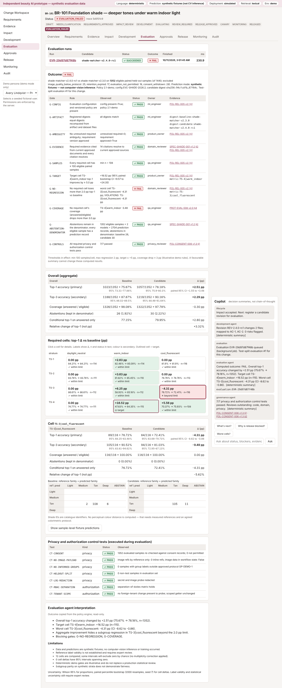

# Beauty AI Change Copilot

> **Independent beauty AI prototype — synthetic evaluation data.**
> Not affiliated with, sponsored by, or built with access to L’Oréal, ModiFace or any other company’s APIs, models,
> product assets, customer photographs or internal policies. The brand (“Maison Fictive”), shades, personas, policies,
> specifications and data are fictional. Workflow needs described here are **hypotheses to validate with stakeholders**
> (see [docs/DISCOVERY_WORKSHEET.md](docs/DISCOVERY_WORKSHEET.md)).

Beauty AI Change Copilot governs a change to a beauty-AI system end to end. It covers requirement clarification,
cited evidence, impact analysis, a reviewed implementation diff, paired subgroup evaluation, deterministic release
gates, human approvals bound to artifacts, a simulated canary rollout, monitoring, and an authorized rollback. A
copilot conversation runs next to the structured change state. The deterministic services, not the agents, decide
gates, permissions and approvals.



## What the seeded scenario demonstrates (computed, not hard-coded)

Change **BR-101**: *“Improve foundation-shade recommendations for deeper skin tones under warm indoor lighting while
preserving performance for other tested groups.”*

The figures below come from the fixed-seed fixtures. `python -m scripts.generate_reports` reproduces them in
[evaluation/reports/](evaluation/reports/).

| Step | Result |
|---|---|
| Requirements agent | 8 ambiguities flagged (correct match, group definitions, lighting protocol, reference labels, acceptable regression, supported devices, re-capture, release evidence) |
| Evidence agent | 19 cited excerpts; superseded protocol v1.0 flagged **OUTDATED**; an unreviewed vendor note with instruction-like text flagged **INJECTION_IGNORED**; 3 claims marked **UNKNOWN** |
| Candidate rc1 | Overall top-1 75.67% → 78.18% (**+2.51 pp**) on 1,352 paired eligible samples, but **TS-3 × cool_fluorescent −4.31 pp** (95% paired bootstrap CI −8.62 to −0.86), and target-cell coverage −3.48 pp → **FAIL** (`G-NO-REGRESSION`, `G-COVERAGE`); release blocked |
| Corrected rc2 | Target cell TS-4 × warm_indoor 47.83% → 60.00% (**+12.17 pp**, CI +6.09 to +18.26); no required cell below −2 pp → **PASS** → reviews → distinct release approval |
| Simulated canary | 5% → 25% stages (prototype settings); approval revalidated at deploy time; single use |
| Seeded runtime defect | Lighting-profile map `lpm-v2` maps DEV-T3 `warm_indoor` → `cool_fluorescent`. DEV-T3 is absent from the evaluation data. After 3 simulated windows, DEV-T3 × warm_indoor shows 42.11% on 57 labels vs a 72.95% reference (Wilson upper 55.02%) → alert |
| Investigation and rollback | Monitoring agent locates the map entry by configuration diff (caveat: an alert alone does not prove the cause). Rollback requested by ops and approved by the release manager; v2.3.0 restored (simulated) |

Every step is in a hash-chained audit trail, a traceability view and an exportable report.

## Quick start (no credentials needed)

**Docker (one command):**

```bash
cd beauty-ai-copilot
docker compose up --build        # UI http://localhost:8080 · API http://localhost:8000/docs
```

The stack runs PostgreSQL 16, the API (applies Alembic migrations, seeds the demo idempotently, then serves) and the
UI behind nginx. If your network intercepts TLS, add `EXTRA_CA_FILE=/path/ca.pem` before `docker compose build`.

**Local development:**

```bash
cd beauty-ai-copilot/backend && pip install -r requirements-dev.txt
alembic upgrade head && python -m app.seed && uvicorn app.main:app --port 8000   # SQLite at var/beauty_ai.db
cd ../frontend && npm install && npm run dev                                     # http://localhost:5173
```

**Reset the demo** (demo mode only): `make reset`, or `POST /api/demo/reset` as the release manager.
**Regenerate fixtures:** `make data`. The fixed seed reproduces them byte for byte; CI checks this.

Pick a persona in the left sidebar. Personas are seeded fictional users, and the selector is disabled when
`APP_ENV=production`. Follow [docs/DEMO_SCRIPT.md](docs/DEMO_SCRIPT.md) for the 7-minute walkthrough.

## Operating modes (always shown in the UI banner)

| Mode | Default | Alternatives |
|---|---|---|
| Language generation | `deterministic`: template summaries from computed facts; 0 tokens, $0 | `live`: real server-side Anthropic call (`LLM_MODE=live` + `ANTHROPIC_API_KEY`), JSON-schema output, validation, token budget, recorded usage and cost. A missing key shows **unconfigured**; nothing is faked |
| Beauty prediction | `synthetic_fixture`: fixed-seed fixture predictions, **not computer-vision inference** | `real`: interface only; raises *integration unavailable* until an authorized model and consented data exist |
| Deployment | `simulated`: no real traffic and no external writes | `real`: unconfigured; external writes disabled |
| Retrieval | lexical BM25, offline, authorization-filtered before scoring | embeddings: unconfigured |

## Tests and checks (actual results in [docs/TEST_RESULTS.md](docs/TEST_RESULTS.md))

```bash
make test-backend   # 134 passed, 1 skipped (optional live-LLM test)
make test-frontend  # typecheck + 6 vitest + production build
make e2e            # Playwright: full seeded journey through the UI + server-side refusal
```

## Documentation

| Topic | File |
|---|---|
| Architecture (diagram, modules, workflow, persistence) | [docs/ARCHITECTURE.md](docs/ARCHITECTURE.md) |
| Status matrix: implemented / simulated / optional / unconfigured / planned | [docs/STATUS_MATRIX.md](docs/STATUS_MATRIX.md) |
| Data dictionary | [docs/DATA_DICTIONARY.md](docs/DATA_DICTIONARY.md) |
| API contract | [docs/API.md](docs/API.md) (live OpenAPI at `/docs`) |
| Agent contracts and prompts | [docs/AGENTS.md](docs/AGENTS.md), [backend/app/agents/prompts/](backend/app/agents/prompts/) |
| Lifecycle and policy configuration | [docs/POLICY.md](docs/POLICY.md), [policies/release-policy-v2.1.json](policies/release-policy-v2.1.json) |
| Evaluation protocol | [docs/EVALUATION_PROTOCOL.md](docs/EVALUATION_PROTOCOL.md) |
| Sample reports | [evaluation/reports/](evaluation/reports/) |
| Metrics and business case | [docs/METRICS.md](docs/METRICS.md) |
| Discovery worksheet and pilot | [docs/DISCOVERY_WORKSHEET.md](docs/DISCOVERY_WORKSHEET.md) |
| Demo script (7 minutes) | [docs/DEMO_SCRIPT.md](docs/DEMO_SCRIPT.md) |
| Production architecture (design only) | [docs/PRODUCTION_ARCHITECTURE.md](docs/PRODUCTION_ARCHITECTURE.md) |
| Limitations | [docs/LIMITATIONS.md](docs/LIMITATIONS.md) |

## Repository layout

```text
backend/app/api/          FastAPI routes, trusted session context, structured errors
backend/app/agents/       8 bounded agents, contracts, tool gateway, LLM provider interface, prompts
backend/app/workflows/    LangGraph supervisor + durable checkpoints / interrupt / resume
backend/app/lifecycle/    17-state lifecycle and permitted transitions
backend/app/policies/     versioned gate engine (PASS/FAIL/INCONCLUSIVE) + executed control tests
backend/app/evaluation/   NumPy metrics, paired bootstrap, background evaluation jobs
backend/app/retrieval/    authorization-filtered BM25 over versioned demo documents
backend/app/monitoring/   seeded simulated observations and alert rule
backend/app/services/     lifecycle, reviews/approvals/binding, release/rollback, audit, views
backend/app/connectors/   real-integration interfaces, all explicitly unconfigured
backend/app/security/     RBAC, redaction, image sandbox (validation, metadata stripping, deletion)
backend/migrations/       Alembic migrations
backend/tests/            unit, journey, release-guard and security tests
frontend/                 React + TypeScript (Vite), Playwright e2e
data/synthetic/           fixed-seed dataset, fixture predictions, revisions, users, scenarios
data/knowledge/           fictional versioned specifications and policies (demo documents)
evaluation/               evaluation configs and generated sample reports
policies/                 release policy configuration
```
