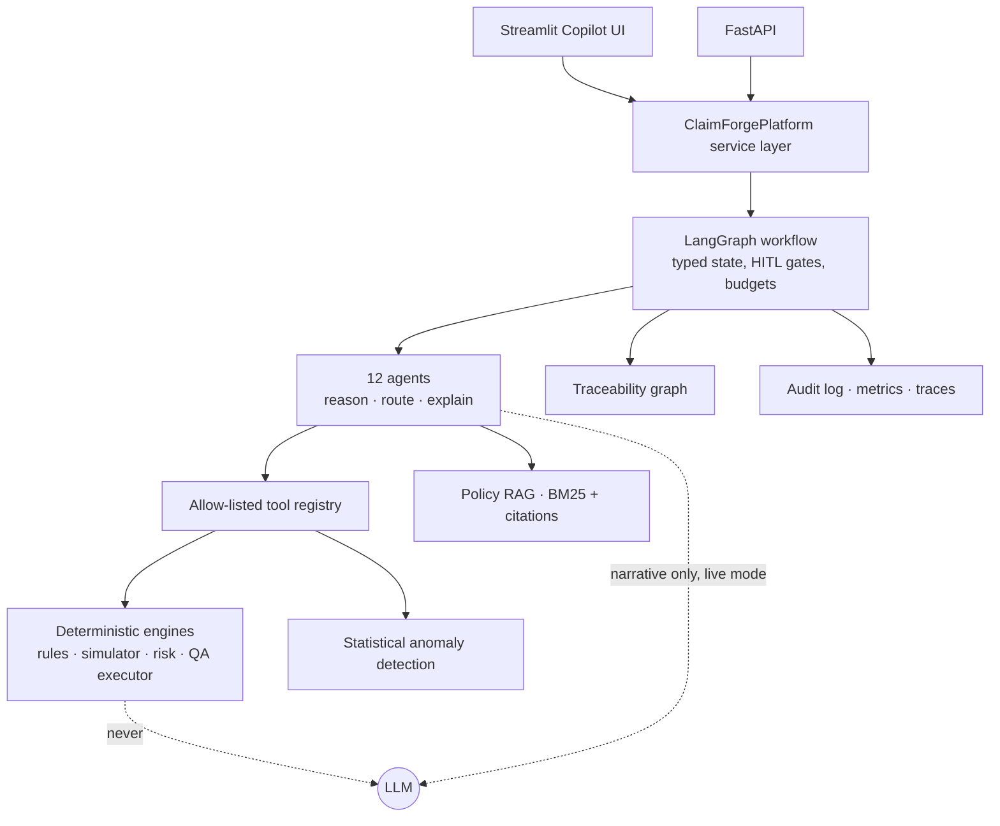

# ClaimForge Copilot

**Agentic SDLC & Production Intelligence for Health Insurance**

> *“From insurance requirement to production intelligence.”*

> ⚠️ **This is a synthetic engineering demonstration.** It is **NOT** medical advice, **NOT** insurance advice,
> **NOT** a production adjudication system and **NOT** a real insurer system. NorthStar Health Benefits and every
> member, provider, claim, policy, release and incident in this repository are fictional.
> **SYNTHETIC DEMO DATA — NOT FOR REAL CLAIM ADJUDICATION.**

ClaimIQ is the production claims-intelligence module inside ClaimForge.


---

## Executive summary

ClaimForge is an AI-assisted engineering and decision-support platform that takes a health-insurance business
requirement through the whole delivery lifecycle (requirement → policy evidence → impact → architecture →
development plan → tests → claims simulation → security/governance → release risk → **human approval** →
simulated deployment) and then keeps going into production. **ClaimIQ** monitors the claims the release
produces, detects a numerical anomaly with statistics, investigates it with a bounded tool-using agent, traces
it back to the release, rule, requirement and policy section, proposes a verified fix, generates a runnable
regression test and a Jira-style defect, and feeds the finding back into the SDLC.

Everything runs locally in **DEMO_MODE with $0 API cost**: no API key and zero LLM calls.

| | Result on the V1 scenario (10,000 synthetic claims, seed 42) |
|---|---|
| Requirement | `BR-391`. The ambiguous threshold wording is **blocked for human clarification** |
| Impact | 3 microservices, 2 APIs, 3 business rules, 3 tables, plus tests, monitoring, docs and member comms |
| Generated tests | 19 executable (+2 API specs). 19/19 pass on the spec, 2 critical fail on the defective build |
| Simulation | 541 outcomes changed, **0 unexpected**. Projected annual impact **$653,010** *(simulated estimate)* |
| Release | Risk 48/100 **MEDIUM**, so **READY WITH APPROVAL**. Deployment needs a human approval token |
| ClaimIQ | Physio AUTH_REQUIRED denial rate **4.81% → 8.48% (+76%, z = 7.0)** vs the approved-spec projection |
| Root cause | **HIGH** confidence: `AUTH_RULE_184` counts CANCELLED visits (violates P-01.3). 64 claims wrongly denied |
| Closed loop | Hotfix verified by replay, regression test `TC-REG-BR391-001`, defect `CLAIMS-1042`, linked back to BR-391 |

## Problem

Health-insurance change is risky. One sentence of business intent ("require authorization after 10 visits")
touches policy wording, several microservices, rule tables, events, tests, member communications and money. The
failures teams see most often are these:

- the requirement is ambiguous and a developer silently picks an interpretation
- the impact is under-estimated
- tests miss boundaries such as visit 10 vs visit 11, or cancelled visits
- a correct specification is implemented incorrectly
- production problems surface weeks later as unexplained denial spikes, and nobody can trace them back to the change

## Why ClaimForge

- **One copilot, many specialists.** Users talk to one product. A supervisor routes the work to 12 specialised agents.
- **Closed-loop SDLC + claims intelligence.** Production evidence becomes regression tests, defects and requirement revisions.
- **Right tool for each job.** Agents reason and explain, RAG retrieves evidence, and deterministic Python adjudicates.
  Statistics detect anomalies, and humans approve consequential actions.

## Product vision & closed-loop SDLC

```mermaid
flowchart LR
    A[Business requirement] --> B[Policy understanding] --> C[Requirement analysis] --> D[Impact analysis]
    D --> E[Architecture] --> F[Development plan] --> G[Test generation] --> H[Synthetic claims]
    H --> I[Claims simulation] --> J[Security / privacy / governance] --> K[Release risk]
    K --> L{{Human approval}} --> M[Simulated deployment] --> N[ClaimIQ monitoring]
    N --> O[Anomaly detection] --> P[Root-cause investigation] --> Q[Release correlation]
    Q --> R[Remediation] --> S[Regression test] --> T[Defect / backlog]
    T -- SDLC feedback --> C
```



## Architecture



The architecture is additive. It wraps the existing (synthetic) NorthStar platform of API Gateway, Kubernetes,
Claims, Benefits, Authorization and Member services, Kafka and PostgreSQL/Oracle, and replaces none of it. See
[docs/ARCHITECTURE.md](docs/ARCHITECTURE.md).

## Why agents?

Agents make sense where the work is **open-ended orchestration and investigation**. Examples:
- deciding which workflow a request needs
- choosing the next investigation step from evidence gathered so far
- weighing competing root-cause hypotheses
- assembling evidence into explanations for different personas

The Root-Cause and Remediation agents run real **bounded loops**: plan → call tool → observe → re-score, then propose → verify.

## Why not everything is an agent

| Concern | Implementation | Why not an LLM |
|---|---|---|
| Eligibility, coverage, effective date, provider, duplicates, visit limits, prior auth, reimbursement, annual max | `app/claims/adjudicator.py` (pure function, versioned rulesets) | Consequential, must be exact, reproducible and auditable |
| Claims simulation & financial impact | `app/simulation/*` | Arithmetic over 10k–100k claims. No LLM inside claim loops |
| Release risk | `app/release/risk.py` | Transparent weighted score + explicit blocking rules |
| “Is this an anomaly?” | `app/monitoring/anomaly.py` | Relative change + z-score. An LLM never decides whether a number is anomalous |
| Approval / deployment / reprocessing | Human gate + consequential tool requiring an approval token | Humans control consequential actions |

**Labels are explicit everywhere:** DETERMINISTIC, STATISTICAL, RETRIEVAL, DETERMINISTIC TEMPLATE, SIMULATED,
MOCKED and LLM-ASSISTED. In DEMO_MODE, agent "reasoning" is deterministic planners and templates, and it is
labelled as such.

## Deterministic claims engine

Rule order, where the first failing rule decides: `ELIG_RULE_001` member eligibility → `EFF_RULE_005` policy
effective date → `PROV_RULE_020` provider → `COV_RULE_010` plan coverage → `DUP_RULE_030` duplicate →
`VIS_RULE_070` visit limit → `AUTH_RULE_184` prior authorization → `REIMB_RULE_050` reimbursement →
`BEN_RULE_090` annual maximum.

Every result carries a status, reason code, rule id, ruleset id and explanation:

```json
{"claim_id": "CLM-SYN-API", "eligible": true, "covered": true, "authorization_required": true,
 "authorization_present": false, "counted_visits": 10, "allowed_amount": 0.0, "reimbursement_amount": 0.0,
 "status": "DENIED", "reason_code": "AUTH_REQUIRED", "rule_id": "AUTH_RULE_184",
 "engine": "DETERMINISTIC RULES ENGINE (no LLM)"}
```

The rulesets are versioned and immutable:

| Ruleset | Release | Physio max | Authorization | Note |
|---|---|---|---|---|
| `RULESET_V1` | 2.3 | $750 | none | current policy |
| `RULESET_V2` | 2.4 | $1,000 | from visit 11 (≥10 COMPLETED) | BR-391 as specified |
| `RULESET_V2_DEFECTIVE` | 2.4 build | $1,000 | counts COMPLETED **+ CANCELLED** | **controlled synthetic defect** |
| `RULESET_V2_1` | 2.4.1 | $1,000 | COMPLETED only | proposed hotfix |

## Policy RAG

Synthetic policy documents live in `synthetic_data/policies`: the Extended Health policy, the Claims Operations
manual and the Privacy standard. They are chunked per section (`P-14.2`, `P-01.3`, and so on) and retrieved with
a local **BM25** index (`app/policies/retrieval.py`), so no paid embedding API is needed. Every hit carries a
citation such as `[NSHB-POL-EHC-2026 §P-14.2]`. If the query terms are not covered, the result is
**`INSUFFICIENT POLICY EVIDENCE`** and nothing is fabricated. Uploaded documents are validated (.md/.txt only,
size limit, UTF-8) and screened for prompt injection, and instruction-like lines are quarantined. Embeddings are
an optional future enhancement.

## LangGraph

`app/graph/workflow.py` compiles a `StateGraph` over the typed `ClaimForgeState` (`app/graph/state.py`):

```
START → supervisor → requirement → policy → ambiguity_check ─(critical)→ human_review → END
      → impact → architecture → developer → qa → simulation → security → governance → release
      ─(BLOCKED / NOT READY)→ return_evidence → END
      → human_approval ─(none / rejected)→ END
      → simulated_release → claimiq_monitoring → anomaly_check ─(no)→ healthy → END
      → root_cause → release_correlation → remediation → qa_regression → defect → sdlc_feedback → END
```

Every node is guarded by `MAX_WORKFLOW_STEPS`, per-node `MAX_AGENT_ITERATIONS`, exception capture and an optional
`stop_after` stage. That stage is what the UI buttons use. The supervisor also routes `POLICY_QA` and
`CLAIMIQ_INVESTIGATION` workflows, which skips unnecessary agents.

## Claim simulation

The seeded generator (`RANDOM_SEED=42`) produces fictional members, providers, appointment histories (completed
and cancelled visits), authorizations and claims. Volumes are 1k, 10k (default), 50k or 100k claims. 10k claims
are generated and adjudicated twice in under 1 s, and 100k in about 6 s. The **Claims Simulation Lab** runs the *same* claims
through the current and proposed rulesets and reports these:
- changed outcomes, approved→denied and denied→approved counts
- payment, approval, denial and authorization deltas
- the financial impact, labelled *SIMULATED ESTIMATE BASED ON SYNTHETIC DATA*

It also classifies every changed claim as **EXPECTED** (explained by the requirement) or **UNEXPECTED**, which
is a regression signal. Running the defective build (`RULESET_V2_DEFECTIVE`) in the lab immediately shows 145 unexpected changes.

## ClaimIQ

ClaimIQ monitors simulated production: claim volume, approval/denial rate, denial-reason mix, authorization
failures, average reimbursement, latency, rule exceptions and release version. You can segment by benefit,
provider, plan, rule version and release. Its key design choice is a **release-aware baseline**: the same
post-release claims are shadow-replayed with the **approved specification**. This separates the *intended*
increase in authorization denials from a defect. A naïve historical baseline would flag the correct release
too, and the UI lets you switch baselines to see that.


## Root-cause analysis

The Root-Cause agent loops over 7 allow-listed deterministic tools:
1. segment metrics
2. denial-reason shift
3. release correlation (change point + manifest)
4. rule → requirement trace
5. claim-level pattern inspection
6. regression suite against the deployed build
7. operational health

It scores five hypotheses (cancelled visits counted / off-by-one / service outage / intended behaviour /
member-mix shift). Confidence is a sum of deterministic evidence weights, not an LLM self-assessment. The result:

```
ANOMALY:          Physiotherapy AUTH_REQUIRED denial rate 4.81% → 8.48% (+76%, z=7.0)
CORRELATED RELEASE: 2.4      CHANGED RULE: AUTH_RULE_184      SOURCE REQUIREMENT: BR-391 (policy P-14.3)
LIKELY DEFECT:    AUTH_RULE_184 counts CANCELLED visits toward the COMPLETED-visit threshold (violates P-01.3)
EVIDENCE:         shift begins week of release · AUTH_REQUIRED = 100% of excess denials · rule changed in 2.4 ·
                  64/64 wrongly denied claims reach 10 only with cancelled visits · 2 cancelled-visit tests fail
CONFIDENCE:       HIGH (1.0)
```

The Remediation agent then verifies candidate fixes by deterministic replay. The forward fix leaves 0 mismatches
against the approved spec and passes all tests, so it is recommended, and rollback is kept as the fallback. It
emits a runnable pytest regression test and the defect `CLAIMS-1042`. The tracker is **MOCKED**, meaning the
defect is stored in memory only.


## Traceability

`app/traceability/graph.py` maintains Requirement → Policy → Business Rule → Component → Implementation → Test →
Release → Production Metric → Anomaly → Incident → Defect, plus a `feeds_back_to` edge from the defect to the
requirement. Forward and reverse tracing, shortest paths and Mermaid export are all supported. For example,
`GET /traceability/CLAIMS-1042` walks back to `REL-2.4`, `AUTH_RULE_184`, `BR-391` and `P-14.3`.

## Human-in-the-loop

| Gate | Behaviour |
|---|---|
| Requirement ambiguity | A CRITICAL ambiguity (e.g. “after 10 visits”: visit 10 or visit 11?) stops at `human_review` with options |
| Architecture change | ADD/REPLACE recommendations are flagged *human review required* |
| Release | No deployment without a recorded human approval. `deploy_release` is a consequential tool that no agent may call |
| Remediation | Fixes are `PROPOSED`. Reprocessing the 64 claims requires approval (O-05.2) |

## Security

The main controls are these. Details are in [docs/SECURITY.md](docs/SECURITY.md).
- secrets come from the environment only, are redacted from logs, and are never returned by the API or UI
- Pydantic validation with `extra="forbid"` and bounded fields
- request size limit and security headers
- upload type and size validation
- prompt-injection screening and quarantine
- a tool allowlist, `MAX_AGENT_ITERATIONS`, `MAX_TOOL_CALLS` and timeouts
- an audit log

The security agent is **advisory**, and no compliance certification is claimed.

## Synthetic data

All identifiers are obviously fictional (`MBR-SYN-000123`, `PRV-SYN-0042`, `CLM-SYN-0000001`), and no names or
addresses are generated. Run `python scripts/generate_synthetic_data.py` to write a 1,000-claim CSV sample to
`synthetic_data/claims/`.

## Use case catalog

There are 40 entries: UC01–UC38 plus two planned integrations. **30 are IMPLEMENTED, 8 PARTIAL and 2 PLANNED.**
The catalog is in the UI, at `GET /use-cases` and in [docs/USE_CASES.md](docs/USE_CASES.md).

## API

FastAPI at `http://localhost:8000`, with OpenAPI docs at `/docs`.

| Method | Path | Purpose |
|---|---|---|
| GET | `/health` | Status, secret-free settings, paid LLM call count |
| GET | `/use-cases`, `/scenarios`, `/rulesets`, `/metrics` | Catalog, demo scenario, rulesets, observability |
| POST | `/requirements/analyze` | Structured requirement + ambiguity |
| POST | `/policy/search`, `/policy/upload` | Cited BM25 retrieval; validated upload |
| POST | `/impact/analyze`, `/architecture/recommend` | Impact map; KEEP/ENHANCE/ADD/REPLACE |
| POST | `/tests/generate` | Generate + execute tests (409 if ambiguity unresolved) |
| POST | `/claims/generate`, `/claims/adjudicate` | Synthetic claims; deterministic adjudication |
| POST | `/simulation/run` | Current vs proposed simulation |
| POST | `/release/assess`, `/release/deploy-simulated` | Risk/readiness; human-approved simulated deploy |
| GET/POST | `/claimiq/metrics`, `/claimiq/detect-anomaly`, `/claimiq/investigate` | ClaimIQ |
| POST | `/defects/generate` | Jira-style defect (mocked tracker) |
| GET | `/traceability/{id}` | Upstream/downstream trace + Mermaid |
| POST | `/workflow/run` | Full LangGraph workflow |

```bash
curl -s -X POST localhost:8000/release/assess -H 'content-type: application/json' \
  -d '{"text":"Increase physiotherapy annual coverage from $750 to $1,000 and require prior authorization after 10 completed visits.","clarifications":{"AMB-AUTH-THRESHOLD":"FROM_VISIT_11"}}'
```

## Installation

```bash
cd claimforge
python -m venv .venv && source .venv/bin/activate   # Python 3.11+
pip install -r requirements.txt
cp .env.example .env                                 # optional; defaults are DEMO_MODE=true
```

## Demo mode (default)

`DEMO_MODE=true` needs no API key and makes zero LLM, paid or external calls. Everything runs on deterministic
engines, templates and local BM25. Start it like this:

```bash
streamlit run frontend/streamlit_app.py      # UI  → http://localhost:8501
uvicorn app.api.main:app --port 8000         # API → http://localhost:8000/docs
python scripts/run_demo.py                   # CLI walkthrough of the V1 scenario
```

## Optional live AI mode

Set `DEMO_MODE=false` and `ANTHROPIC_API_KEY` in the environment (or in `.env`, which is git-ignored), then run
`pip install anthropic`. The LLM may then rephrase narratives, labelled **LLM-ASSISTED**. Its output never feeds
adjudication, scoring, anomaly detection or any gate. If the SDK, network or key is missing, it falls back to the
deterministic template. The key is never logged, returned or shown.

## Docker

```bash
docker compose up --build
# api → http://localhost:8000   ui → http://localhost:8501
```

## Testing

```bash
python -m pytest        # 36 tests: unit, integration (closed loop) and API
```

The suite covers all 33 mandated checks. Among them:
- demo mode makes zero LLM calls, verified with network access blocked
- the visit 10 / 11 boundaries
- cancelled-visit exclusion
- the defect injection
- the ambiguity block
- evidence citations, and no fabrication when evidence is missing
- impact, QA boundaries and release blocking
- the HITL gate
- the anomaly detector
- root-cause → rule → requirement links
- the regression test, the defect and end-to-end traceability
- iteration, step and tool budgets
- API health and validation
- reproducibility

## Screenshots

`docs/screenshots/`: Copilot clarification gate, release assessment, ClaimIQ anomaly, root cause & SDLC feedback.

## Limitations

- In DEMO_MODE, agent reasoning is deterministic planners and templates, by design. Live mode only enhances narratives.
- Requirement parsing covers benefit-limit, reimbursement-percentage and authorization-threshold changes. Other
  requests are flagged as unstructured, not guessed.
- The production data, deployments, incidents and trackers are **simulated or mocked**. State is held in memory per process.
- FHIR is a documented mapping only. Enterprise integrations are interfaces only (`app/integrations/adapters.py`).
- Security and governance reviews are rule-based advisory checks, not formal assessments.
- Retrieval is BM25 (lexical). Paraphrases with no shared terms may return insufficient evidence.

## Future roadmap

- LLM-planned investigation steps, constrained to the same tool allowlist and budgets
- Optional local embeddings with hybrid BM25 retrieval
- Real adapters: Jira/Azure DevOps, Confluence/SharePoint, GitHub/GitLab, Jenkins/SonarQube, Splunk/Datadog,
  ServiceNow, a Kafka `claims.adjudicated` consumer, and FHIR R4 Claim/EOB
- LangGraph checkpointing (resume after approval without re-running deterministic steps); OpenTelemetry/LangSmith exporters
- Persistent stores (PostgreSQL) for approvals, traceability and audit
