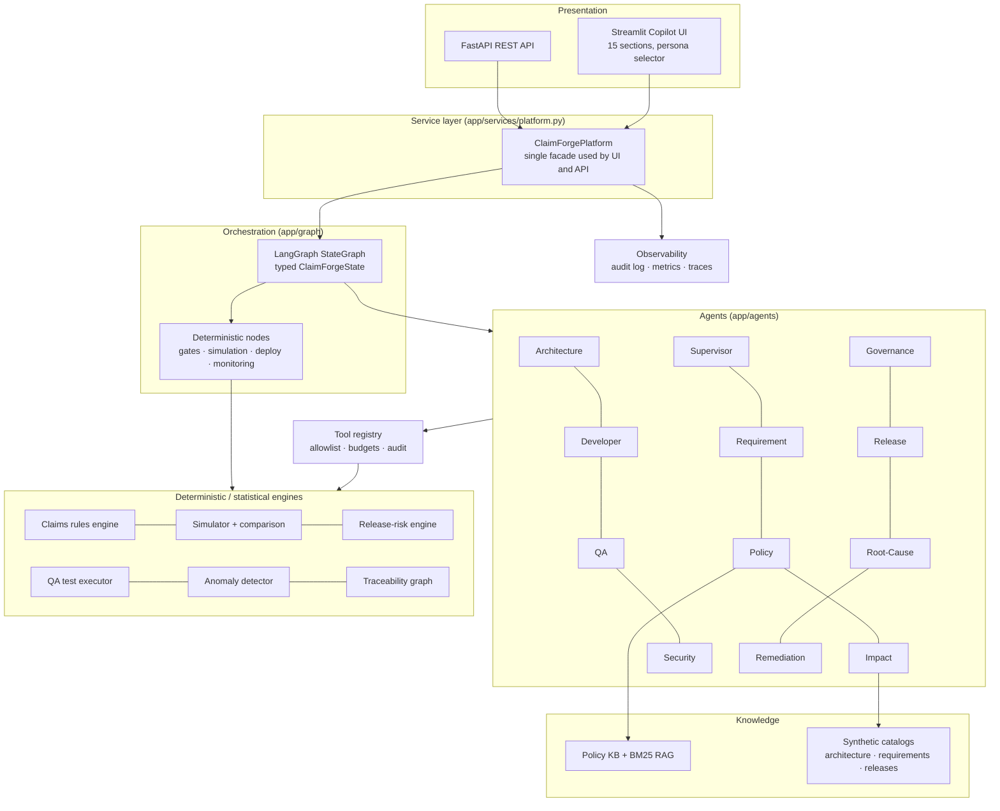
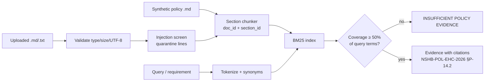
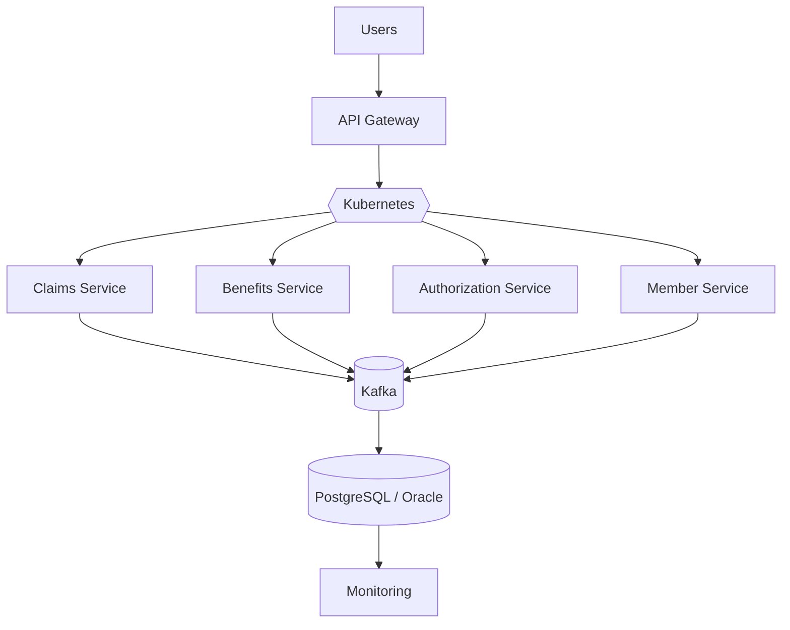
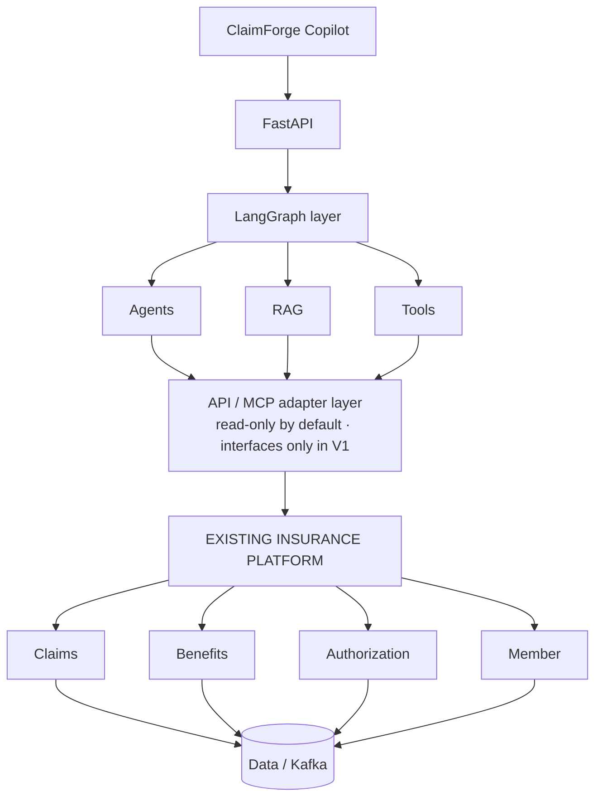
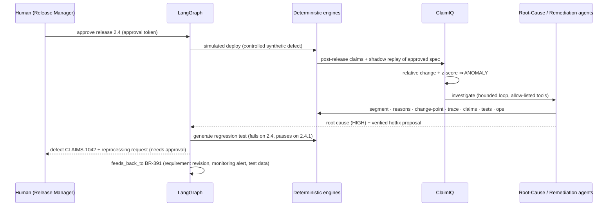

# ClaimForge Architecture

> SYNTHETIC DEMO — all systems, data and organisations are fictional.

## 1. Logical architecture

The UI and the API both call `ClaimForgePlatform`, so no business logic is duplicated. Agents never contain
claim arithmetic; they call engines.

## 2. Multi-agent architecture

```mermaid
flowchart LR
    S[Supervisor<br/>intent routing · budgets] --> R[Requirement]
    R --> PO[Policy RAG]
    PO --> AMB{Ambiguity gate}
    AMB -- critical --> HR[[Human clarification]]
    AMB --> I[Impact] --> AR[Architecture] --> D[Developer] --> Q[QA]
    Q --> SIM[(Simulation engine)] --> SE[Security] --> GO[Governance] --> RE[Release]
    RE -- BLOCKED / NOT READY --> EV[Return evidence]
    RE --> HA[[Human approval]] --> DEP[(Simulated deploy)]
    DEP --> MON[(ClaimIQ monitoring)] --> AN{Anomaly?<br/>statistics}
    AN -- no --> OK[Healthy]
    AN -- yes --> RC[Root-Cause agent loop] --> CORR[(Release correlation)]
    CORR --> RM[Remediation agent loop] --> RG[(Regression test)] --> DF[(Defect)] --> FB[SDLC feedback]
    FB -. feeds_back_to .-> R
```

Rounded boxes are agents, cylinders are deterministic nodes, and double boxes are human gates.

### Guardrails per node (`app/graph/workflow.py::_guarded`)
- `MAX_WORKFLOW_STEPS` (default 60) is a global node budget; LangGraph's `recursion_limit` is a second backstop.
- `MAX_AGENT_ITERATIONS` (default 8) caps re-invocations of any node, and bounds the Root-Cause and Remediation loops.
- `MAX_TOOL_CALLS` (default 20) and `AGENT_TIMEOUT_SECONDS` apply per agent run, through `ToolBudget`.
- Exceptions are captured: the workflow ends `FAILED` with errors, never silently.

## 3. Deterministic engine

- `app/claims/adjudicator.py::decide` is the single pure function holding all adjudication logic. It is used by the
  single-claim API, the batch simulator, the production simulation and the QA executor.
- Rulesets are immutable, versioned dataclasses (`app/claims/rulesets.py`), and parameters are diffable through `diff_rulesets`.
- Batch adjudication orders claims by (member, benefit, date, id), so the year-to-date accumulator and duplicate
  detection are deterministic.
- A *schedule* of `(effective_from, ruleset)` models a release switching rules mid-year.

## 4. RAG

Uploaded documents receive an `UPLOAD-` prefix so they can never shadow curated policy IDs. Retrieved text is
data: in live mode it is wrapped in `<untrusted_data>` tags.

## 5. API layer

FastAPI (`app/api/main.py`, routes in `app/api/routes/`) handles the transport concerns:
- Request models validated with Pydantic (`extra="forbid"`, bounded lengths)
- A body-size middleware that returns 413
- Security headers
- Typed error mapping: 400 validation/value, 404 unknown id, 409 needs human clarification, 403 tool policy, 500 generic with no details

## 6. Data layer

| Data | Location | Nature |
|---|---|---|
| Policies | `synthetic_data/policies/*.md` | Synthetic documents |
| Architecture catalog | `synthetic_data/architecture/current_architecture.json` | Synthetic components, facets, actions |
| Requirements, releases | `synthetic_data/requirements`, `synthetic_data/releases` | Synthetic |
| Claims, members, providers, authorizations | generated in memory (`app/simulation/generator.py`); CSV sample in `synthetic_data/claims` | Seeded synthetic |
| Approvals, deployments, defects, traceability, audit | in-memory | Demo only |

## 7. Observability

Each workflow run records the following. The `Tracer.add_exporter` hook is where OpenTelemetry or LangSmith can
be attached later; neither is required.
- `request_id`, persona, workflow
- node order, agent vs deterministic kind, per-node latency
- tool calls, errors, and the paid LLM call count

Logs are structured JSON with a secret-redaction filter. They contain identifiers and counts, never claim payloads.

## 8. Security

See [SECURITY.md](SECURITY.md).

## 9. Current-state insurance architecture (synthetic)

## 10. ClaimForge integration architecture (additive)

ClaimForge never replaces the deterministic claims engine. The Architecture agent enforces this with a guardrail
that raises `ArchitectureGuardrailViolation` if a REPLACE ever targets a component flagged `deterministic_engine`.

### FHIR awareness (mapping only, not implemented)

| ClaimForge | FHIR R4 |
|---|---|
| Member | Patient + Coverage.beneficiary |
| Plan / Benefit | Coverage / InsurancePlan |
| Claim / ClaimLine | Claim / Claim.item |
| AdjudicationResult | ClaimResponse / ExplanationOfBenefit |
| Provider | Practitioner / Organization |
| Authorization | ClaimResponse (preAuthRef) |

## 11. Production feedback loop

### Release-aware anomaly baseline
A historical baseline would flag the *intended* new AUTH_REQUIRED denials of a correct release. ClaimIQ instead
shadow-replays the same post-release claims with the approved specification, and tests the excess with a Poisson
z-score `(observed − expected)/√expected`. With no defect injected, no anomaly is raised, and that case is covered
by a test.
