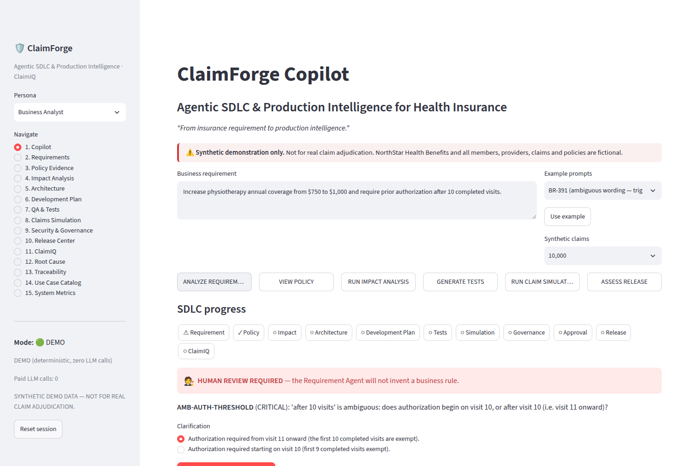
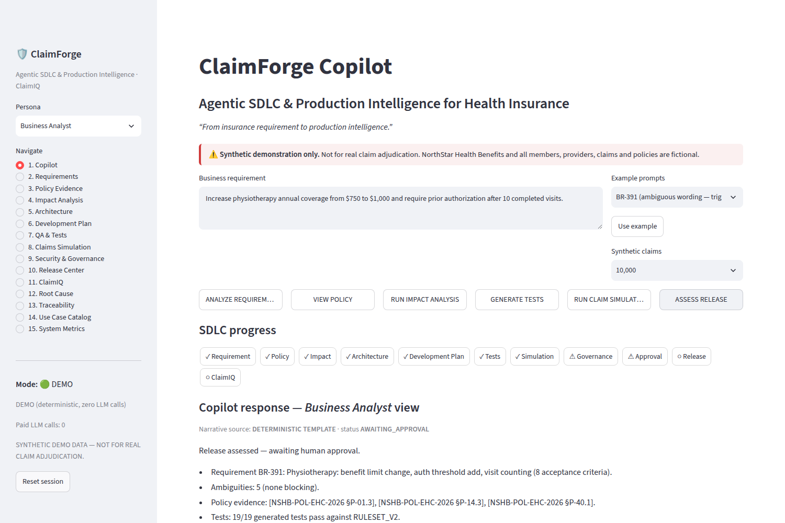
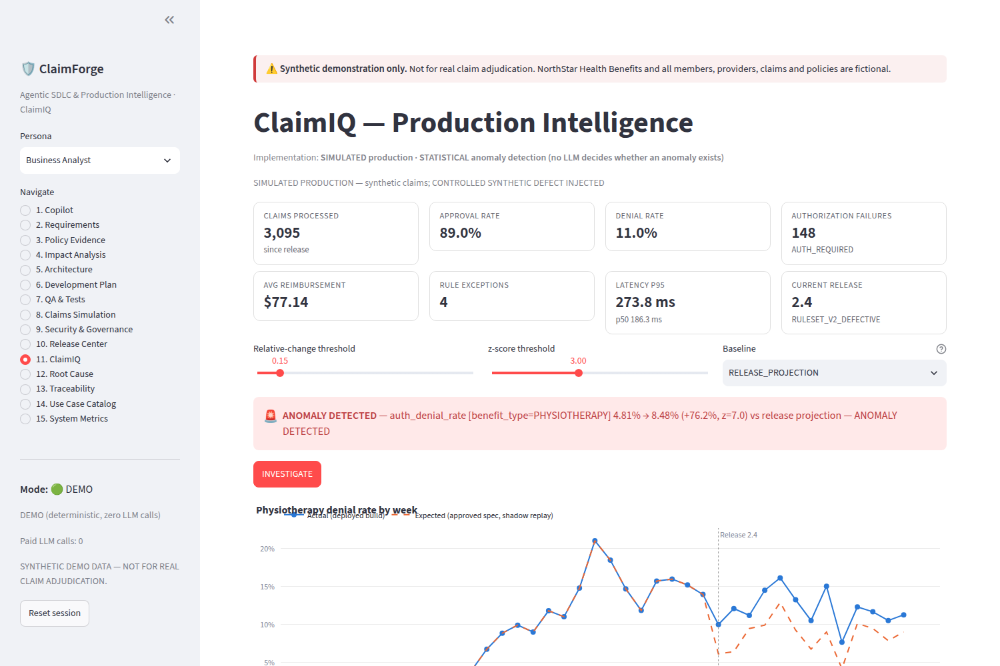
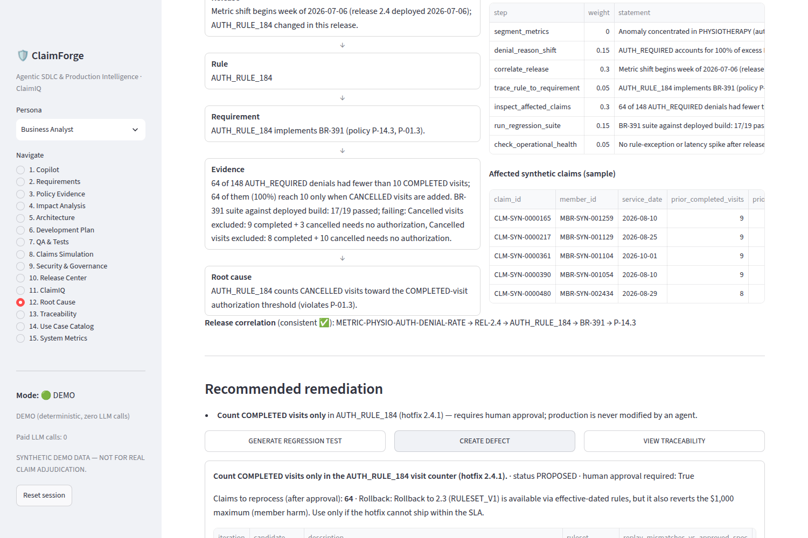

# The Bug Was Hiding in a Cancelled Appointment

### I built an AI copilot for health-insurance software. The most useful thing it learned to do was say "I'm not sure."

---

*Every company, person and claim in this story is fictional. I built a synthetic insurer, "NorthStar Health Benefits," so I could break it on purpose.*

---

## Monday, 9:00 a.m.

A product manager types one sentence into a ticket:

> **"Increase physiotherapy annual coverage from $750 to $1,000 and require prior authorization after 10 completed visits."**

It sounds generous, simple and quick: change a number, add a rule, ship it by Friday.

The sentence actually touches two policy clauses, three microservices, two APIs, three rule tables, an event schema, the regression suite, the monitoring dashboards and a legally required 30-day member notice. It also affects money on every physiotherapy claim from that day on.

It also contains a trap. Read it again: *"after 10 completed visits."*

Does a patient need authorization **on** their 10th visit, or **from** their 11th? Two reasonable engineers will read it differently, and whichever one writes the code decides how real people get reimbursed.

That gap between what a business means and what a developer builds is where many expensive defects come from. I wanted to see whether AI could help close that gap without becoming a new source of risk itself.

---

## The rule I set before writing any code

There's a version of this project that would demo beautifully and be a disaster in practice: a chatbot that reads a claim and decides whether to pay it.

I never wanted to build that. You don't hand claim adjudication to a language model. It isn't reproducible, it isn't auditable, and when it's wrong it sounds just as confident as when it's right.

So **ClaimForge Copilot** is built around one question asked at every step: *does this actually need an LLM?*

- **Paying or denying a claim** is plain Python: one pure, versioned rules function that gives the same answer every time and records a reason code.
- **Finding the policy clause** is local search with citations. If no clause supports an answer, it says so.
- **Deciding whether a number is anomalous** is statistics, not vibes.
- **Approving anything consequential** is a human decision.
- **Agents** do the parts that are open-ended: routing work, investigating, weighing evidence and explaining it.

The whole thing runs in demo mode with **zero LLM calls and $0 in API costs**. AI is optional, and even when it's switched on it only rewrites explanations. It never touches a decision.

You talk to one copilot. Behind it, twelve specialist agents, orchestrated with LangGraph, pass the work along.

---

## Act I: the copilot that stopped

I pasted the PM's sentence in and clicked **Analyze**.

The Requirement Agent pulled out user stories, business rules and acceptance criteria, and then it **stopped**:

> 🧑‍⚖️ **HUMAN REVIEW REQUIRED.** "After 10 visits" is ambiguous. Does authorization begin on visit 10, or from visit 11?



It wasn't an error. The agent was built to recognise that this decision belongs to a person.

I picked *"from visit 11 onward,"* and everything downstream unlocked:

- **The Policy Agent** found the clauses with citations: §P-14.2 for the $750 cap, §P-14.3 for the 10-visit rule, and a small definition in §P-01.3 that says ***cancelled appointments do not count as visits.*** Keep that one in mind.
- **The Impact Agent** mapped the blast radius: three microservices, two APIs, three rules, three tables, plus tests, dashboards and member letters. It recommended replacing exactly one thing, a hardcoded `750` buried in legacy code, and refused to recommend replacing the claims engine.
- **The QA Agent** wrote boundary tests for the cases that usually break: the 10th versus the 11th visit, $990 paid against a $1,000 cap, the day before the policy starts. Then it **ran them**, and 19 of 19 passed.
- **The simulation lab** pushed **10,000 synthetic claims** through the old rules and the new ones side by side. 541 claims changed outcome, and **none of the changes were unexpected**. The projected impact was about $653K a year, labelled as a simulated estimate.

The Release Agent scored the risk at 48/100, **MEDIUM**, and said: *Ready — with human approval.*

I played the release manager and clicked **Approve**.



The copilot handled the hard part of SDLC planning in seconds. In most projects, this is where the story ends.

---

## Act II: something goes wrong

To test the second half of the system, I planted a bug.

It's a realistic kind of bug. The specification was correct and the tests were correct, but the shipped build counted **completed *and* cancelled** appointments toward the 10-visit threshold.

Think about who that hurts. Take a patient with 9 real visits and one appointment they cancelled because their kid was sick. The system counts 10 visits, demands authorization she doesn't need yet, and denies her claim.

Nothing crashes, and no error appears in any log. The rejection looks like a perfectly valid policy decision.

In a real company, a bug like this can sit unnoticed for weeks until someone in claims operations eventually notices denials creeping up and starts a very long email thread.

---

## Act III: ClaimIQ notices

**ClaimIQ** is the production-intelligence half of ClaimForge, and it caught a problem that a naive monitor would have got wrong.

The naive approach compares denials after the release with denials before it. That raises an alarm even for a perfect release, because the new authorization rule is *supposed* to deny more claims.

ClaimIQ asks a sharper question: ***what should denials look like if the release did exactly what was approved?*** It replays the same production claims through the approved specification and compares reality against that expectation.

> 🚨 **ANOMALY DETECTED.** Physiotherapy authorization denials: **4.81% expected → 8.48% actual (+76%, z = 7.0).**



No LLM was asked whether 8.48% "seemed high." A z-score of 7 is not a matter of opinion. When I re-ran it without the planted bug, ClaimIQ stayed quiet, which matters just as much.

---

## Act IV: the investigation

I clicked **Investigate**, and the Root-Cause Agent started working like a careful detective with a strict budget. It ran seven tools in order, and each one narrowed the search:

1. *Where is it happening?* Only physiotherapy.
2. *Why are claims denied?* "Authorization required" explains **100%** of the excess.
3. *When did it start?* The week **Release 2.4** shipped, the release that changed rule **AUTH_RULE_184**.
4. *Why does that rule exist?* Requirement **BR-391**, policy §P-14.3.
5. *Who was affected?* This was the key step. Every one of the **64 wrongly denied claims** reached "10 visits" **only when cancelled appointments were included.**
6. *Do the tests agree?* Run against the deployed build, exactly the two cancelled-visit tests fail.
7. *Could it be an outage?* No: latency is normal and there are no errors.

It considered five explanations: cancelled visits being counted, an off-by-one error, a service outage, intended behaviour, and a change in the patient mix. One survived, and four were ruled out with evidence.

> **Root cause (HIGH confidence):** AUTH_RULE_184 counts cancelled visits toward the completed-visit threshold, violating policy §P-01.3.

That tiny definition from Act I, the one that says cancelled appointments aren't visits, turned out to be the clue that solved it.

The confidence score isn't the agent grading its own work. It's computed from evidence weights. When I limited the agent to three steps, it honestly reported **INCONCLUSIVE** and refused to file a defect. Saying "I don't know" is a designed behaviour here, not a failure.

---

## Act V: closing the loop

Finding the bug is only half the job. The Remediation Agent then:

- **Proposed a fix**, "count COMPLETED visits only," and **verified it** by replaying production claims. That gave zero mismatches against the approved spec, with every test passing.
- **Warned against the easy option.** Rolling back would also cancel the $1,000 coverage increase, so it would hurt every member to fix a bug that affected some of them.
- **Wrote a real regression test**, runnable pytest code that fails on the broken build and passes on the fix.
- **Filed a defect**, `CLAIMS-1042`, linked to the release, rule, requirement and policy clause.
- **Requested approval** to reprocess the 64 claims, because no agent gets to change payments on its own.



Then the defect fed back into the original requirement. The cancelled-visit test became a mandatory release gate, a new monitoring alert was added, and the test-data generator was fixed, since it had never generated cancelled appointments.

You can follow the whole chain in either direction:

**Requirement → Policy → Rule → Code → Test → Release → Metric → Anomaly → Incident → Defect → back to the Requirement.**

---

## What building this taught me

**1. The best AI behaviour is often restraint.** The moments that build trust are the ones where the system stops: *this is ambiguous*, *I have no policy evidence for that*, *I couldn't conclude*. Fluent confidence is cheap.

**2. Agents belong in open-ended work.** Deciding what to investigate next is a good job for an agent. Calculating a reimbursement is not.

**3. Monitoring needs to know what was supposed to change.** Comparing against last month raises false alarms. Comparing against the approved specification finds real defects.

**4. Be honest about what's real.** Everything in the app is labelled deterministic, statistical, simulated, mocked or AI-assisted. Of 40 catalogued use cases, 30 are implemented, 8 are partial and 2 are planned.

---

## Try it yourself

It's open, it runs locally on synthetic data, and it costs nothing:

```bash
cd claimforge
pip install -r requirements.txt
streamlit run frontend/streamlit_app.py
```

**Code:** https://github.com/florina787/Data-sets/tree/claude/dreamy-hawking-6m7l6h/claimforge

*Built with Python, LangGraph, FastAPI, Streamlit and pytest, with 36 passing tests.*

---

> **The LLM doesn't decide anyone's claim.**
> Deterministic code does the math. Statistics spots the anomaly. Agents investigate and explain.
> **And humans make the calls that matter.**

*If this was useful, a 👏 helps other engineers find it. I'd especially like to hear how you'd handle "inconclusive" in your own agent designs.*

*Tags: Artificial Intelligence · Agentic AI · LangGraph · Software Engineering · HealthTech*
