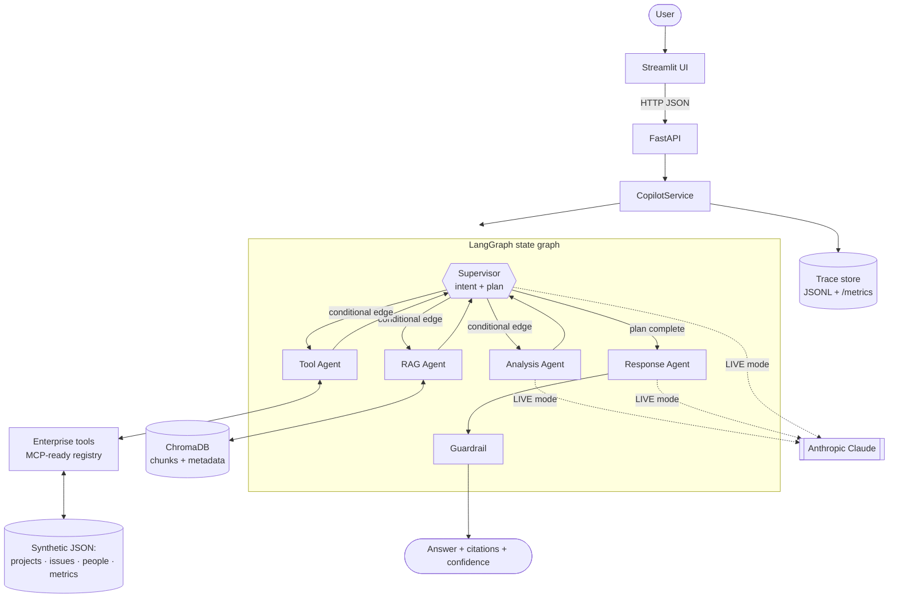

# 🧭 Enterprise Agentic AI Copilot

> **From scattered enterprise knowledge to trusted action.**

An enterprise-style agentic AI assistant built with **LangGraph, LangChain, FastAPI, ChromaDB, Streamlit and Anthropic Claude**. It takes a business question and follows these steps:

1. It classifies what kind of task the question is.
2. It routes the question through specialised agents (retrieval, enterprise tools, analysis).
3. It writes a grounded answer with **citations down to the chunk**.
4. A guardrail validates the answer before it is returned.
5. Each step's latency, tokens and agent path are traced.

     -f59e0b)

> ⚠️ **All enterprise data in this repository is synthetic.** "NovaGrid Corp", its projects (Phoenix, Atlas, Orion), people, issues, metrics and documents are entirely fictional. They were created to demonstrate enterprise AI workflows. Email addresses use the reserved `.example` domain.

---

## Table of contents

- [Project overview](#project-overview)
- [Business problem](#business-problem)
- [Architecture](#architecture)
- [Why LangGraph](#why-langgraph)
- [Agents](#agents)
- [RAG pipeline](#rag-pipeline)
- [Demo mode vs Live AI mode](#demo-mode-vs-live-ai-mode)
- [Technology stack](#technology-stack)
- [Screenshots](#screenshots)
- [Installation](#installation)
- [Environment configuration](#environment-configuration)
- [How to run](#how-to-run)
- [Docker](#docker)
- [API examples](#api-examples)
- [Example questions](#example-questions)
- [Observability](#observability)
- [Testing](#testing)
- [Project structure](#project-structure)
- [Security considerations](#security-considerations)
- [Future improvements](#future-improvements)
- [Why I built this](#why-i-built-this)

---

## Project overview

| Capability | How it is implemented |
|---|---|
| Understand the task | LangGraph **supervisor** classifies intent (8 intents) and plans a route |
| Retrieve knowledge | **RAG agent**: chunking → embeddings → **ChromaDB** → hybrid re-ranking |
| Act on systems | **Tool agent** calls typed enterprise tools (status, issues, people, metrics), designed to be **MCP-ready** |
| Reason over evidence | **Analysis agent** summarises, compares, finds risks, extracts actions, recommends |
| Answer with proof | **Response agent** writes *Answer / Key Findings / Recommended Actions / Sources* with `[S1]`/`[T1]` citations |
| Stay trustworthy | **Guardrail** checks grounding, validates citations, redacts sensitive data and scores confidence |
| Be observable | Per-request trace: request ID, path, agents, tool calls, retrieval count, latency, tokens, errors |
| Be safe to publish | Starts in **DEMO mode**: no API key and zero paid LLM calls |

## Business problem

Enterprise knowledge is scattered. Status reports live in documents, issues in a tracker, people in an HR directory and delivery KPIs in dashboards. A delivery leader who asks *"Are we going to make the October release, and what should I do this week?"* has to piece the answer together by hand.

A basic chatbot is not enough. Enterprises need answers that are:

- **Grounded**: based on actual sources, with citations.
- **Actionable**: they combine documents *and* live systems.
- **Governed**: no leaked secrets or personal data, and low-confidence answers say so.
- **Observable**: every step can be traced and audited.

This project shows that pattern end to end.

## Architecture



**Routing examples** (each specialist returns to the supervisor, which picks the next step):

| Question | Intent | Route |
|---|---|---|
| What is the current status of Project Phoenix? | `project_status` | Supervisor → RAG → Tools → Response → Guardrail |
| What are the major delivery risks? | `risk_analysis` | Supervisor → RAG → Analysis → Response → Guardrail |
| Summarize the architecture document. | `summarization` | Supervisor → RAG *(whole document)* → Analysis → Response → Guardrail |
| Which issues are blocking the October release? | `issue_lookup` | Supervisor → Tools → Response → Guardrail |
| Compare the project status with the delivery metrics. | `comparison` | Supervisor → RAG → Tools → Analysis → Response → Guardrail |
| What actions should the engineering manager take this week? | `action_planning` | Supervisor → RAG → Tools → Analysis → Response → Guardrail |

The plan can also change mid-run. If retrieval finds nothing and a project is known, the supervisor inserts the Tool agent before it answers.

## Why LangGraph

- **Explicit control flow.** Nodes and conditional edges make the agent route a first-class, testable artifact rather than an opaque loop.
- **Typed shared state.** `CopilotState` is a `TypedDict` with reducers (`operator.add` for the execution path, a custom token-usage reducer, `add_messages` for chat). Each agent returns only its partial update.
- **Supervisor pattern.** The supervisor runs again after every specialist. It can adapt the plan and decides when the task is complete.
- **Production-ready path.** Checkpointers, human-in-the-loop interrupts, streaming and LangSmith tracing can be added without restructuring the code.

## Agents

| Agent | File | Responsibility |
|---|---|---|
| **Supervisor** | `app/agents/supervisor.py` | Classifies intent (Claude with structured output in LIVE mode; deterministic rules in DEMO mode or as a fallback), resolves projects (by name, alias or release month such as "October release"), plans the route, adapts it and decides when work is done |
| **RAG** | `app/agents/rag_agent.py` | Semantic top-k retrieval with hybrid re-ranking. If a question names a document ("the architecture document"), it loads the whole document in reading order. Every chunk keeps `filename`, `document_id` and `chunk_id` |
| **Tool** | `app/agents/tool_agent.py` | Chooses tool calls (Claude in LIVE mode, rules in DEMO mode). If no project is named, it infers one from the retrieved evidence. Runs tools with validated arguments; failures are captured, not raised |
| **Analysis** | `app/agents/analysis_agent.py` | Summaries, comparisons, risks, action items and recommendations as a structured `AnalysisResult`. Every finding carries its evidence keys |
| **Response** | `app/agents/response_agent.py` | Writes *Answer / Key Findings / Recommended Actions*. The **Sources** section is generated by code from the citation labels actually used, so it can't be hallucinated |
| **Guardrail** | `app/guardrails/validator.py` | Redacts first, then validates citations, checks grounding (token and **number** support against the evidence), flags unsupported claims, scores confidence and states *"More information is required"* when confidence is low |

**Enterprise tools** (`app/tools/enterprise_tools.py`): `get_project_status`, `get_open_issues`, `search_employee_directory`, `get_delivery_metrics` and `list_projects`. Each tool has a Pydantic input schema. The registry exports **MCP-shaped descriptors** (`name`, `description`, `inputSchema`) through `GET /tools`, and LangChain `StructuredTool`s, so exposing them through an MCP server only requires iterating the registry.

## RAG pipeline

```text
.md / .txt / .pdf
   → loader (UTF-8 / pypdf, title detection, content hash)
   → section-aware chunker (markdown headings → RecursiveCharacterTextSplitter, 800 chars / 120 overlap)
   → embeddings (sentence-transformers all-MiniLM-L6-v2; lexical hashing fallback)
   → ChromaDB (cosine, persistent; one collection per embedding model)
   → retrieval (over-fetch k×3 → hybrid score = 0.7·vector + 0.3·keyword overlap + title boost → threshold)
   → evidence with {filename, document_id, chunk_id, section, score}
```

- **Incremental ingestion**: unchanged documents are skipped (content hash). Changed or re-uploaded documents replace their old chunks.
- **Stable IDs**: `document_id` is a filename slug (`project_phoenix_status_report`); `chunk_id` is `<document_id>#c003`.
- **Honest fallback**: if sentence-transformers or its model can't be loaded, the app switches to a lexical hashing embedding *and says so* in `/health` and the UI.

## Demo mode vs Live AI mode

| | **DEMO mode** (default) | **LIVE AI mode** |
|---|---|---|
| API key | Not needed | `ANTHROPIC_API_KEY` from the environment only |
| LLM calls | **Zero.** No LLM client is even constructed | Anthropic Claude via `langchain-anthropic` |
| Answers | Built offline from the **actual retrieved chunks and tool results** of each request (no canned text), so answers change when documents change | Generated by Claude from the same evidence |
| Tokens | Estimated (clearly labelled as estimates) | Real usage from the API response |
| Intended for | Public demos, GitHub visitors, CI | Your own machine or private deployment |
| Workflow | Full LangGraph route, RAG, tools, guardrail and tracing | Identical |

Both modes run the **same graph and the same guardrail**. If a Claude call fails in LIVE mode, the affected agent falls back to its deterministic path and the error appears in the response and the trace. Nothing pretends to work silently.

> The mode is a **server-side environment setting**. The UI can't switch it, so visitors to a public demo can never trigger paid calls.

## Technology stack

| Layer | Technology |
|---|---|
| Orchestration | LangGraph (`StateGraph`, conditional edges, reducers) |
| LLM | Anthropic Claude via `langchain-anthropic` (LIVE mode) |
| RAG | ChromaDB · sentence-transformers · LangChain text splitters · pypdf |
| API | FastAPI · Pydantic v2 · pydantic-settings · Uvicorn |
| UI | Streamlit · pandas |
| Observability | Built-in trace store (JSONL + `/metrics`); LangSmith-ready |
| Quality | pytest (67 tests, mocked LLM) · type hints · structured logging |
| Deployment | Docker · docker-compose |

## Screenshots

> _Add your own screenshots here after running the app._

| Chat + agent route | Sources with chunk-level provenance | Metrics & traces |
|---|---|---|
| `docs/screenshots/chat.png` | `docs/screenshots/sources.png` | `docs/screenshots/metrics.png` |

## Installation

Requires **Python 3.11+**.

```bash
git clone <your-fork-url>
cd enterprise-agentic-ai
python -m venv .venv && source .venv/bin/activate      # Windows: .venv\Scripts\activate
pip install -r requirements-dev.txt                    # core + pytest
pip install -r requirements-embeddings.txt             # recommended: semantic embeddings (installs PyTorch)
cp .env.example .env                                   # optional; defaults work without it
```

> On Linux, install CPU-only PyTorch first for a much smaller download:
> `pip install torch --index-url https://download.pytorch.org/whl/cpu`

## Environment configuration

All configuration comes from environment variables or a local, git-ignored `.env`. See [`.env.example`](.env.example).

| Variable | Default | Description |
|---|---|---|
| `APP_MODE` | `demo` | `demo` (no key, zero LLM calls) or `live` (Claude) |
| `ANTHROPIC_API_KEY` | – | Required only when `APP_MODE=live`. Never commit it |
| `ANTHROPIC_MODEL` | `claude-sonnet-5-5` | Claude model ID for LIVE mode |
| `EMBEDDING_PROVIDER` | `sentence-transformers` | Or `hashing` (offline, lexical) |
| `EMBEDDING_MODEL` | `sentence-transformers/all-MiniLM-L6-v2` | sentence-transformers model |
| `RETRIEVAL_TOP_K` | `5` | Chunks per query |
| `CONFIDENCE_THRESHOLD` | `0.45` | Below this, answers are flagged *"More information is required"* |
| `ALLOW_UPLOADS` / `MAX_UPLOAD_MB` | `true` / `5` | Upload controls (disable for a public deployment if desired) |
| `API_BASE_URL` | `http://localhost:8000` | Used by the Streamlit UI |
| `LANGSMITH_TRACING` / `LANGSMITH_API_KEY` | – | Optional LangSmith tracing |

Settings are validated at startup. For example, `APP_MODE=live` without a key fails fast with a clear message, and the `.env.example` placeholder is treated as "not set".

## How to run

```bash
# Terminal 1: API (DEMO mode by default)
uvicorn app.api.main:app --reload --port 8000

# Terminal 2: UI
streamlit run frontend/streamlit_app.py --server.port 8501
```

- Streamlit UI: <http://localhost:8501>
- FastAPI docs (Swagger): <http://localhost:8000/docs>

**LIVE AI mode** (local/private use, with your own key):

```bash
export APP_MODE=live
export ANTHROPIC_API_KEY=sk-ant-...        # or put both in .env
uvicorn app.api.main:app --port 8000
```

## Docker

```bash
docker compose up --build          # API on :8000, UI on :8501, DEMO mode
docker compose down
```

- The image pre-downloads the embedding model at build time, so the container runs offline.
- Build a slim image without PyTorch: `INSTALL_SENTENCE_TRANSFORMERS=false docker compose up --build` (uses hashing embeddings).
- LIVE mode: put `APP_MODE=live` and `ANTHROPIC_API_KEY=...` in your local `.env`. Compose passes them only to the API container. The UI container never receives the key.

## API examples

```bash
curl http://localhost:8000/health

curl -X POST http://localhost:8000/chat \
  -H "Content-Type: application/json" \
  -d '{"question": "Which issues are blocking the October release?"}'

curl -F "file=@my_notes.md" http://localhost:8000/documents/upload

curl http://localhost:8000/tools       # MCP-shaped tool descriptors
curl http://localhost:8000/metrics     # aggregates + recent traces
curl http://localhost:8000/documents   # indexed documents
```

Abbreviated `/chat` response:

```json
{
  "request_id": "261fb4a9b823",
  "mode": "demo",
  "intent": "issue_lookup",
  "route": ["Supervisor", "Tools", "Response", "Guardrail"],
  "answer": "### Answer\nThere are 3 open release blockers for release 2026.10: **PHX-214** ... [T1]\n...",
  "citations": [{"label": "T1", "source_type": "tool", "tool_name": "get_open_issues"}],
  "tool_calls": [{"tool_name": "get_open_issues", "arguments": {"project_id": "PRJ-PHOENIX", "blocking_only": true, "release": "2026.10"}, "success": true}],
  "guardrail": {"passed": true, "grounding_score": 1.0, "citation_validity": 1.0, "redactions": []},
  "confidence": 1.0,
  "latency_ms": 12.4,
  "token_usage": {"total_tokens": 891, "llm_calls": 0, "estimated": true}
}
```

## Example questions

- What is the current status of Project Phoenix?
- What are the major delivery risks?
- Summarize the architecture document.
- Which issues are blocking the October release?
- Compare the project status with the delivery metrics.
- What actions should the engineering manager take this week?
- Who is the engineering manager for Phoenix?
- What is the data residency requirement?
- *Out of scope:* "What is the price of bananas in Tokyo?" (the guardrail answers *"More information is required"*)

## Observability

Every request produces a trace with **request ID, timestamp, mode, intent, agents invoked, execution path, per-node latency, tool calls (with success and duration), retrieval count, total latency, tokens, confidence and errors**.

- Stored in memory (ring buffer) and appended to `data/traces/traces.jsonl`.
- Aggregated at `GET /metrics` (average and p95 latency, intent mix, tool and agent usage) and shown in the UI's **Traces** tab.
- **LangSmith**: set `LANGSMITH_TRACING=true` and `LANGSMITH_API_KEY`. The graph is invoked with `run_name`, `tags` and `metadata.request_id`, so LangSmith runs correlate with local traces. No code changes are needed.

## Testing

```bash
python -m pytest            # 67 tests, about 2 seconds, no network, no API credits
```

| Suite | Covers |
|---|---|
| `test_routing.py` | Intent classification of all demo questions, plan construction, release→project resolution, adaptive re-planning, LLM routing and fallback |
| `test_retrieval.py` | Chunk IDs and provenance, incremental ingestion, ranking, off-topic rejection, document targeting |
| `test_tools.py` | Every tool, filters, validation errors, MCP descriptors, LangChain export |
| `test_guardrails.py` | Redaction (keys, phones, SSNs, cards, personal emails), invalid citations, unsupported claims, low confidence |
| `test_graph.py` | All six demo questions end to end with expected routes, citations, traces, and LIVE mode with a **mocked Claude** (including outage fallback) |
| `test_llm_provider.py` | DEMO mode constructs no LLM; LIVE provider builds offline with model-safe defaults |
| `test_api.py` | `/health`, `/chat`, `/documents/upload`, `/tools`, `/metrics`, validation, settings validation, and **API key never appears in any response** |

## Project structure

```text
enterprise-agentic-ai/
├── app/
│   ├── agents/          # supervisor, rag, tool, analysis, response agents; offline synthesizer; prompts
│   ├── api/             # FastAPI app factory + routes
│   ├── config/          # pydantic-settings, logging (with secret masking)
│   ├── graph/           # LangGraph state, workflow, node instrumentation
│   ├── guardrails/      # grounding/citation validator, sensitive-data redaction
│   ├── llm/             # LLM provider protocol + Anthropic implementation
│   ├── models/          # domain + API Pydantic models
│   ├── observability/   # request tracing + metrics aggregation
│   ├── rag/             # loader, chunker, embeddings, Chroma store, ingestion, retriever
│   ├── services/        # CopilotService (graph entry point used by the API)
│   ├── tools/           # synthetic data repository + MCP-ready tool registry
│   └── container.py     # dependency wiring (composition root)
├── data/
│   ├── documents/       # 6 synthetic enterprise documents (markdown)
│   └── synthetic/       # projects, issues, employees, delivery metrics (JSON)
├── frontend/            # Streamlit app, API client, styles
├── tests/               # pytest suites (LLM mocked)
├── .env.example  .gitignore  .dockerignore
├── requirements.txt  requirements-embeddings.txt  requirements-dev.txt
├── Dockerfile  docker-compose.yml  Makefile
└── README.md
```

## Security considerations

- **No secrets in the repository.** Only `.env.example` (with a placeholder) is committed; `.env` is git-ignored. The repository and its Git history were scanned for credentials before publishing.
- **Keys stay server-side.** `ANTHROPIC_API_KEY` is read only from the environment into a `SecretStr`. It never appears in API responses, `/health`, traces, logs (a logging filter masks `sk-ant-…` patterns) or the UI. A test asserts this for every endpoint.
- **Public-safe by default.** The app starts in DEMO mode, and in that mode no LLM client exists. The mode can't be changed from the UI.
- **Output guardrail.** Redacts API keys, credentials, phone numbers, SSN-like numbers, Luhn-valid card numbers and non-corporate email addresses. Redaction runs *before* any other check, so quoted claims can't leak data.
- **Grounding.** Citations are validated against the actual evidence, uncited and unsupported claims are flagged, and low-confidence answers say that more information is required.
- **Upload hardening.** Extension allow-list (`.md`, `.txt`, `.pdf`), size limit, filename sanitisation, and an `ALLOW_UPLOADS` switch.
- **Container.** Runs as a non-root user. Only the API container receives LLM credentials.
- **Before production you would add**: authentication/SSO, per-tool authorisation scopes, rate limiting, prompt-injection screening of uploaded documents, and audit-log retention policies.

## Future improvements

- Expose the tool registry through an **MCP server** and consume external MCP tools.
- Cross-encoder **re-ranking** and hybrid BM25 + vector search.
- **Streaming** responses and token-by-token UI updates.
- Conversation memory with a LangGraph **checkpointer** (per-session threads).
- **Human-in-the-loop** approval before actions are executed in real systems.
- LLM-as-judge **evaluation suite** (faithfulness, answer relevance) in CI.
- Role-based access control on documents and tools.
- OpenTelemetry export and LangSmith dashboards.

## Why I built this

Most GenAI demos stop at "chat with your PDF". Real enterprise value comes from **systems that can be trusted**:

- **Orchestrated**: the system decides which capabilities a question needs and runs them in an explicit, inspectable graph.
- **Grounded**: every claim points to a document chunk or a tool result, and unsupported claims are flagged.
- **Actionable**: answers combine unstructured knowledge with live operational data and end in concrete recommendations.
- **Observable**: every request is traced from routing to validation, with latency, token and error accounting.
- **Responsible**: it is safe to publish, keeps secrets out, and is honest when confidence is low.

This project demonstrates how enterprise GenAI can move **beyond basic chatbots toward orchestrated, grounded and observable AI systems**, which is the kind of architecture I believe production AI copilots need.

---

<sub>All data is synthetic. NovaGrid Corp and every person, project and figure in this repository are fictional.</sub>
