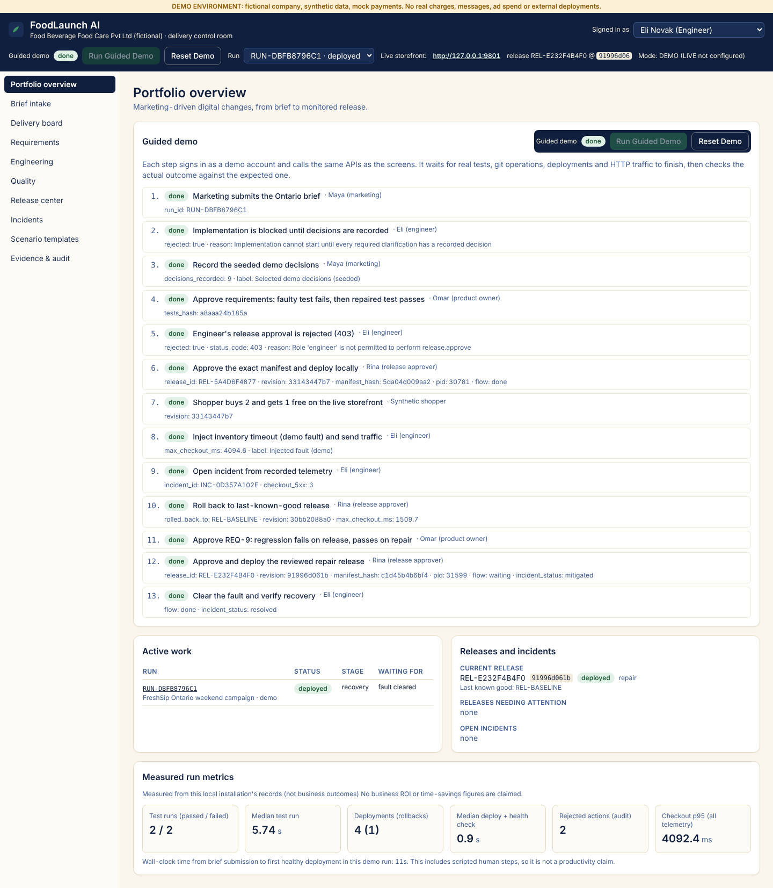

# FoodLaunch AI

> An agentic SDLC control room for marketing-driven digital changes, and the small storefront it actually changes, tests, deploys and operates.

**Portfolio prototype. Everything is synthetic.** *Food Beverage Food Care Private Limited* is fictional. So are its products, customers, sales, inventory and telemetry. Payments are mocks. No real charges, customer messages, advertising spend or external deployments ever happen. A persistent DEMO banner says so on every screen.



## What it demonstrates

Marketing submits one sentence:

> *"Launch a weekend Ontario campaign: buy two eligible FreshSip beverages and receive one free, once per customer, while stock lasts."*

The platform takes it through brief → clarification → requirements → design → code change → tests → release review → local deployment → monitoring → incident → repair. Three episodes are mandatory, and all three run against real code:

| Episode | What really happens |
|---|---|
| **A. Clarify before building** | The Brief Analyst flags 9 ambiguities. One is *once per order or once per campaign?*, and the promotions policy defines no default for it (shown as a **policy gap**). The server refuses to start implementation until each one has a recorded decision. Seeded answers are labelled **Selected demo decision**. |
| **B. Catch a business-logic defect** | The Implementation Agent applies a seeded *Fixture proposal* patch to an isolated git worktree. The protected acceptance suite runs (`pytest`, exit code 1): the free unit survives removal of the paid units (REG-001). The Repair Agent applies a candidate patch, and the **same hash-checked tests** pass (exit code 0) on the new revision. |
| **C. Investigate a release incident** | After an approved local release, a labelled demo fault makes the inventory dependency time out. Real requests fail (HTTP 500 after about 4 s) and are recorded as telemetry. The Incident Analyst links the failures to the release and its diff (`timeout=None`), keeping evidence separate from hypotheses. Mitigation is an approved **rollback** to the last-known-good release. Then a separately reviewed **repair release** fails fast (503, cart kept, no order), and recovery is verified once the fault is cleared. |

The fault is predetermined. The incident analysis is a deterministic rule set and says so; it is **not** presented as autonomous root-cause discovery.

## Quick start (no API key needed)

Requirements: Python 3.11+, [uv](https://docs.astral.sh/uv/), Node.js 20+ and npm, git.

```bash
cd foodlaunch-ai
scripts/start.sh          # first run installs pinned deps (uv.lock, package-lock.json) and builds the UIs
```

* Control room: <http://127.0.0.1:8700>
* Live storefront (managed process): <http://127.0.0.1:8801>

Then sign in with any demo account in the header and click **Run Guided Demo**. The demo signs in as each role, runs 13 real steps and checks every outcome. It takes about 40 s. Or click through the same flow yourself, following [docs/SCENARIO_GUIDE.md](docs/SCENARIO_GUIDE.md).

```bash
scripts/reset_demo.sh     # deterministic reset (also available as "Reset Demo" in the UI)
scripts/test.sh           # lint, patch-sync check, backend tests, UI typecheck and build
npm run e2e               # Playwright browser test of the full flagship flow (isolated ports 9700/9801)
```

If Playwright cannot find a browser, set `PLAYWRIGHT_CHROMIUM_PATH` to a Chromium binary.

### Demo accounts (local only, not SSO)

| Account | Role | May |
|---|---|---|
| `maya.marketing` | marketing | submit briefs, record clarification decisions |
| `omar.product` | product_owner | approve requirement sets (freezes the test plan) |
| `eli.engineer` | engineer | run controls, fault injection, traffic, incident analysis |
| `rina.release` | release_approver | approve releases, deploy, roll back |
| `val.viewer` | viewer | read only |

The password for every account is `demo-only-password`. The UI account picker just logs in with these credentials. Sessions and permissions are enforced **server-side** on every action, and rejected attempts are written to the audit log.

## What is real, what is scripted

Every artifact in the UI carries one provenance label:

| Label | Meaning | Examples |
|---|---|---|
| Executed tool result | A command actually ran and its exit code was captured | `git apply`, `pytest`, `ruff`, deployments, health checks, HTTP traffic |
| Deterministic calculation | Rule-based logic over recorded data | ambiguity checklist, release gates, telemetry statistics, incident rules |
| Fixture proposal / scripted fixture | Seeded content, labelled as such | the three patches, requirement templates, design |
| Selected demo decision | Seeded answer to a clarification | "once per authenticated customer per campaign" |
| Live AI output | Only when LIVE mode is configured | Brief Analyst / Requirements Agent |
| Injected fault (demo) | The demo fault control | inventory timeout |

**LIVE mode is optional.** Set `ANTHROPIC_API_KEY` and `ANTHROPIC_MODEL` (no model name is hardcoded). The Brief Analyst and the Requirements Agent then call Claude server-side and validate the output against a Pydantic schema. Without credentials, a LIVE run fails visibly; scripted output is never substituted. LIVE runs stop before implementation because live-generated patches are not executed (no container sandbox is configured). See [docs/IMPLEMENTATION_STATUS.md](docs/IMPLEMENTATION_STATUS.md).

## Architecture in one paragraph

A single FastAPI backend (port 8700) holds three modules: **delivery** (LangGraph flows, services, release gates), **commerce simulation** (inventory system plus a demo fault switch) and **telemetry** (JSONL ingest and queries). It also serves the control-room UI. The **FreshSip storefront** is a separate FastAPI application whose source lives in a local git repository (`var/storefront-repo`). Every candidate is a commit in an isolated worktree. Deploying exports the *exact approved commit* and starts it as its own uvicorn process (port 8801), with a PID file, port-collision checks and health checks. A rollback redeploys the last-known-good commit. Details and diagrams: [docs/ARCHITECTURE.md](docs/ARCHITECTURE.md).

## Repository layout

```
apps/control-room/       React + TS + Vite + Tailwind control room (9 screens + templates, evidence)
apps/storefront/         FreshSip storefront UI (served by whichever storefront revision is deployed)
backend/app/             FastAPI platform: agents/, graph/ (LangGraph), services/, tools/
backend/tests/           platform tests (gates, auth, stale approvals, resume, rollback, sandbox…)
fixtures/storefront/     storefront stage trees (v1.0 baseline → v1.1 campaign → v1.2 repair)
fixtures/patches/        unified diffs generated from the stages (scripts/regen_fixture_patches.py)
fixtures/acceptance_tests/  protected, AC-tagged acceptance suite (owned by the QA agent)
fixtures/docs/           synthetic, versioned source documents (retrieval index)
fixtures/seed/           flagship scenario: brief, clarification checklist, requirements, design
fixtures/templates/      five secondary scenario templates (preview only)
e2e/                     Playwright browser tests
docs/                    architecture, contracts, scenario guide, results, gaps, status, LinkedIn
scripts/                 setup / start / reset / test / patch regeneration
```

## Documentation

* [Architecture and traceability diagrams](docs/ARCHITECTURE.md)
* [Agent and tool contracts](docs/AGENTS_AND_TOOLS.md)
* [Scenario guide](docs/SCENARIO_GUIDE.md)
* [Security and sandbox](docs/SECURITY_AND_SANDBOX.md)
* [Test results](docs/TEST_RESULTS.md) and [screenshots](docs/screenshots/)
* [Production gaps](docs/PRODUCTION_GAPS.md)
* [Implementation status](docs/IMPLEMENTATION_STATUS.md)
* [LinkedIn demo script and post](docs/LINKEDIN.md)

## Honest limits

This is a single-machine prototype. It does not replace engineers, it does not certify releases as secure, and it makes no claims about time savings, revenue or production adoption. The metrics on the overview page are measured from this installation's own records: test runs, deployments, audit events and telemetry.
