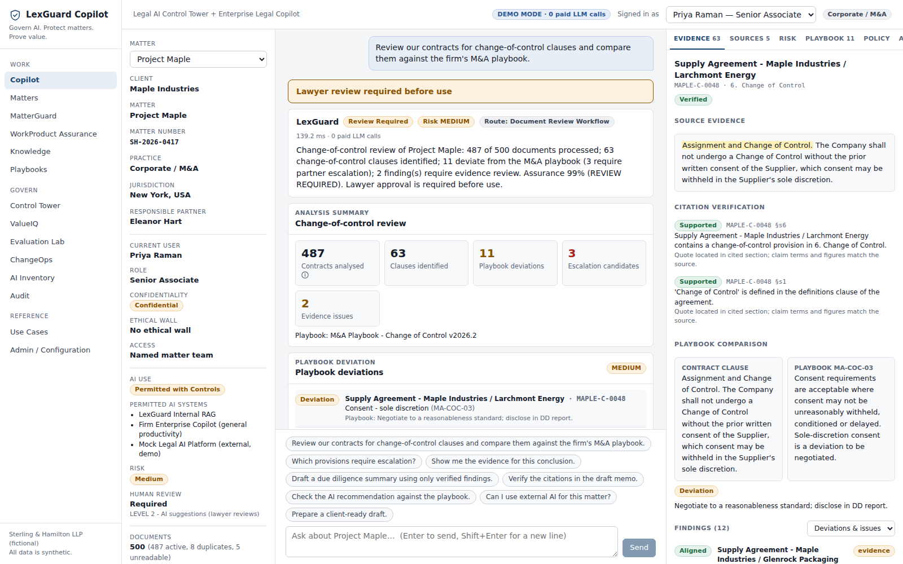
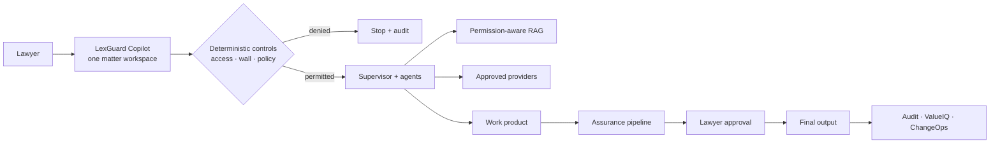
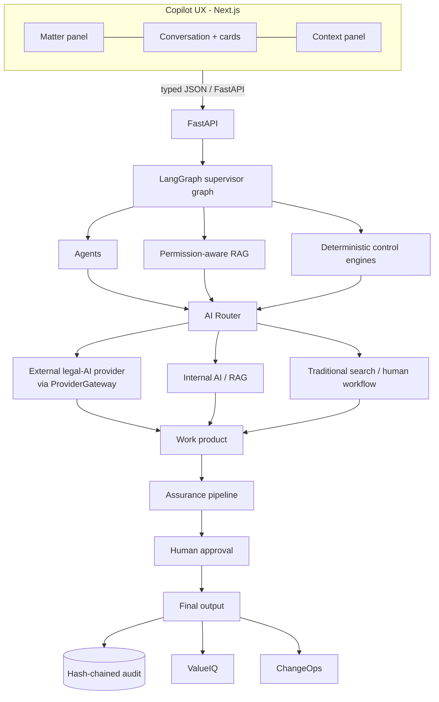
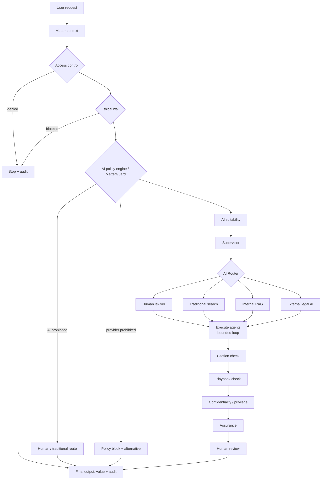
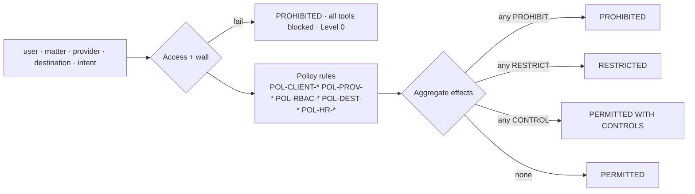
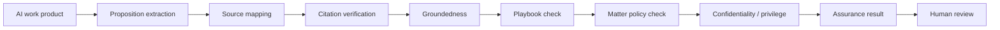

# LexGuard Copilot

**Legal AI Control Tower + Enterprise Legal Copilot** — *Govern AI. Protect matters. Prove value.*

LexGuard is a governed Copilot interface sitting above an enterprise multi-agent legal-AI architecture.
It is **not** a replacement for lawyers and **not** a clone of any commercial legal-AI platform. External
legal-AI platforms are treated as *governed execution providers* that LexGuard may route appropriate work to.

> All data in this repository is **synthetic**. Sterling & Hamilton LLP, its lawyers, clients, matters and
> documents are fictional. The demo runs with **no API key** and makes **zero paid LLM calls**.



---

## Contents

1. [Executive summary](#executive-summary) · 2. [Problem](#problem) · 3. [Product](#product) ·
4. [Why Copilot frontend + multi-agent backend](#why-copilot-frontend--multi-agent-backend) ·
5. [Architecture](#architecture) · 6. [Agent architecture](#agent-architecture) ·
7. [Deterministic control layer](#deterministic-control-layer) · 8. [MatterGuard](#matterguard) ·
9. [AI Router](#ai-router) · 10. [RAG](#rag) · 11. [Assurance](#assurance) ·
12. [Citation verification](#citation-verification) · 13. [PlaybookGuard](#playbookguard) ·
14. [PrivilegeGuard](#privilegeguard) · 15. [Human-in-the-loop](#human-in-the-loop) ·
16. [Control Tower](#control-tower) · 17. [ValueIQ](#valueiq) · 18. [Evaluation](#evaluation) ·
19. [ChangeOps](#changeops) · 20. [Security](#security) · 21. [Synthetic data](#synthetic-data) ·
22. [Use cases](#use-cases) · 23. [Installation](#installation) · 24. [Demo](#demo) · 25. [Docker](#docker) ·
26. [Testing](#testing) · 27. [Limitations](#limitations) · 28. [Roadmap](#roadmap)

Further reading: [ARCHITECTURE](docs/ARCHITECTURE.md) · [AGENTS](docs/AGENTS.md) · [SECURITY](docs/SECURITY.md) ·
[GOVERNANCE](docs/GOVERNANCE.md) · [USE_CASES](docs/USE_CASES.md) · [PROVIDER_INTEGRATION](docs/PROVIDER_INTEGRATION.md) ·
[HARVEY_INTEGRATION](docs/HARVEY_INTEGRATION.md) · [DEMO](docs/DEMO.md) · [LINKEDIN_DEMO](docs/LINKEDIN_DEMO.md)

---

## Executive summary

LexGuard gives a law firm one Copilot per matter. Behind it, a LangGraph supervisor orchestrates 15 backend
agents, a permission-aware RAG layer supplies evidence, and **deterministic control engines** (RBAC, matter access,
ethical walls, client AI policy, provider registry, approval gates, tool allowlists, iteration limits) decide what
may happen — *before* any retrieval or model use. Every AI work product passes an assurance pipeline (citation
verification, playbook check, confidentiality/privilege review) and waits for a lawyer's approval. Every step is
written to a hash-chained audit trail, and ValueIQ, the Control Tower, the Evaluation Lab and ChangeOps make the
programme governable and measurable.

What runs today, end to end, with zero paid model calls:

| Scenario | Outcome |
|---|---|
| Project Maple change-of-control review (500 synthetic contracts) | 487 processed · 63 clauses · 11 playbook deviations · 3 escalations · 2 evidence issues · assurance 99 % **REVIEW REQUIRED** · partner approval |
| Project Aurora: "send to the external legal-AI provider" | **BLOCKED** by `POL-CLIENT-003`, alternative offered, audited, no data sent |
| Matter Beta (ethical wall) | **ACCESS DENIED** before retrieval; no partition of the walled matter is read |
| "Should our client accept the $20 million settlement?" | **HUMAN DECISION REQUIRED**; AI limited to cited decision support |
| AI memo with 10 propositions | 8 supported · 1 partial · 1 unsupported → external delivery blocked |
| AI recommendation "accept unrestricted counterparty veto" | **ESCALATION REQUIRED** (`MA-COC-05`) |
| ChangeOps: "AI research for external use requires citation verification" | affected workflows, practices, providers, prompts, tests, regression eval, approval, simulated deploy |

> The assurance score measures **traceability and verification completeness**, not legal correctness. A 99 % score
> still returns *REVIEW REQUIRED* because one source was not found and one was only partially supported.

## Problem

Law firms are adopting generative AI faster than they can govern it. Typical failure modes:

* **Matter leakage** — retrieval systems that fetch broadly and filter afterwards; ethical walls that tools ignore.
* **Client instructions ignored** — clients that prohibit external GenAI still see matter data sent to vendors.
* **Unverifiable output** — plausible memos with missing, wrong or invented citations reaching clients.
* **Autonomy creep** — agentic systems drifting into consequential legal judgment.
* **No proof of value** — adoption measured in prompts rather than hours, rework and risk.
* **Unmanaged change** — policies change but workflows, prompts and providers are not re-evaluated.

## Product



Navigation: **Copilot · Matters · MatterGuard · WorkProduct Assurance · Knowledge · Playbooks · Control Tower ·
ValueIQ · Evaluation Lab · ChangeOps · AI Inventory · Audit · Use Cases · Admin / Configuration**.

## Why Copilot frontend + multi-agent backend

Users interact with **one Copilot**. They never choose an agent, a retrieval pipeline, a policy engine or a provider —
the Supervisor and the deterministic controls do. Agents stay backend intelligence and are made visible only through
the collapsible **"How LexGuard analyzed this"** trace.

| Layer | Responsibility | In this repo |
|---|---|---|
| Copilot | User experience | `frontend/` (Next.js, React, TypeScript) |
| Multi-agent system | Reasoning and orchestration | `backend/app/graph`, `backend/app/agents` (LangGraph) |
| RAG | Evidence and institutional knowledge | `backend/app/rag` |
| Deterministic engines | Permissions, policy, risk, governance, hard controls | `access`, `policy`, `matterguard`, `security`, `routing` |
| External AI platforms | Optional execution providers | `backend/app/providers` (mock + interfaces) |
| Human lawyer | Final authority for consequential decisions | `governance/review.py`, approval gates |

## Architecture



LangGraph routing (implemented in `backend/app/graph/builder.py`):



See [docs/ARCHITECTURE.md](docs/ARCHITECTURE.md) for state, modules and data flow.

## Agent architecture

15 agents (catalogue at `GET /agents`); the Supervisor invokes only those a request needs.

| Agent | Role | Tools (allowlist) |
|---|---|---|
| Supervisor | Intent + matter context → minimal plan; iteration/tool limits; approval gates | — |
| Matter Intake | Resolves user/client/matter; deterministic intent; injection screening | — |
| AI Policy | Runs MatterGuard; explains decisions with evidence | — |
| AI Routing | Suitability scores; route selection | — |
| Legal Knowledge | Firm policy / playbook / precedent retrieval | `knowledge_search` |
| Document Analysis | Clauses, DD, comparison, obligations, timelines, entities, summaries | `matter_document_search`, `clause_extraction`, … |
| Legal Research | Grounded research; decision-support packs | `knowledge_search`, `matter_document_search` |
| Playbook | PlaybookGuard | `playbook_compare` |
| Citation Verification | Proposition-level verification | `citation_verify` |
| WorkProduct Assurance | Assurance pipeline and score | `citation_verify` |
| Privilege / Confidentiality | PrivilegeGuard | `privilege_scan` |
| Drafting | Template-grounded drafting from verified findings | `draft_generate`, `citation_verify`, `playbook_compare` |
| Value Analysis | ValueIQ | `value_calc` |
| Change Impact | ChangeOps impact analysis | — |
| Evaluation | Baseline vs candidate evaluation | — |

Example: *"Can I use external AI for this matter?"* invokes Matter Intake → AI Policy → AI Routing → Supervisor →
policy explainer only. No document analysis, drafting or verification runs. Details: [docs/AGENTS.md](docs/AGENTS.md).

## Deterministic control layer

None of these depend on an LLM — they are plain Python over typed data:

RBAC · matter access · ethical walls · client AI restrictions · approved-provider list · document permissions
(sensitivity clearances) · provider permissions · external-delivery restrictions · mandatory approval gates ·
maximum agent iterations · tool-call budget · request timeouts · tool allowlists · policy blocking rules.

```python
# backend/app/policy/engine.py (excerpt)
if p.provider.external and not pol.external_ai_allowed:
    hits.append(RuleHit(PROHIBIT, "POL-CLIENT-003", f"{client} prohibits external generative AI ..."))
# backend/app/governance/review.py (excerpt)
if dest.startswith("external") and assurance_status != "PASS":
    raise ReviewError("ASSURANCE_GATE", "External delivery blocked ...")
```

Retrieval can only be performed with a **sealed `AccessScope`**, which only `build_access_scope` can create after
access and wall checks. A forged scope raises `ScopeViolation` (tested).

## MatterGuard

`POST /matterguard/evaluate` — inputs: user, client, matter, task, provider, document sensitivity, destination.
Returns `PERMITTED | PERMITTED_WITH_CONTROLS | RESTRICTED | PROHIBITED` plus risk, reasons, policy evidence (rule
IDs + source policy sections), allowed tools, blocked tools, human-review level and external-distribution permission.



## AI Router

Routes: `NO_AI · HUMAN_LAWYER · TRADITIONAL_SEARCH · LEGAL_RESEARCH_PLATFORM · DETERMINISTIC_WORKFLOW · INTERNAL_RAG ·
ENTERPRISE_COPILOT · EXTERNAL_LEGAL_AI · DOCUMENT_REVIEW_WORKFLOW · AGENTIC_WORKFLOW · HYBRID`.
It **never defaults to agentic AI** — every response lists each route considered and why it was or was not selected.
AI suitability (AI, agentic, legal-judgment risk, confidentiality, privilege, autonomy, evidence requirement,
human-review requirement) is computed by fixed formulas (`backend/app/routing/suitability.py`).

## RAG

Synthetic corpus: firm AI policies, client instructions, outside-counsel guidelines, 516 matter documents,
precedents, playbooks, templates, research notes and institutional knowledge. Section-level chunking with
metadata (source ID, section ID, matter ID, client ID, practice ID, access label, sensitivity) and local BM25.

**Security before retrieval:** chunks live in partitions keyed by access label (`firm`, `practice:ma`,
`client:C-001`, `matter:M-1001`). The retriever only names partitions in the sealed scope; unauthorised partitions
are never read or scored, and IDF statistics are computed only over permitted partitions so unauthorised documents
cannot influence ranking. Retrieval is limited to the **active** matter — even other matters the user can access.

## Assurance



Score = 0.20·citation coverage + 0.30·citation support + 0.10·source coverage + 0.15·playbook adherence +
0.10·matter-policy compliance + 0.15·verification completion − 0.5·unsupported-claim rate.
**PASS** requires ≥ 90 % *and* no unsupported, missing-source or partially supported material proposition.
External delivery is blocked unless assurance is PASS. The score is explicitly **not** a measure of legal correctness.

## Citation verification

Every material proposition is labelled `SUPPORTED`, `PARTIALLY_SUPPORTED`, `UNSUPPORTED` or `SOURCE_NOT_FOUND` with
claim, citation, source, status and evidence text. Checks: source exists *within the permitted scope* (unauthorised
sources are reported as not found, never disclosed), section exists, quote located, figures in the claim present in
the source, absolute language not in the source, drafting placeholders (`[●]`, `[NTD`) in the source. Missing
citations are reported as unsupported — LexGuard never invents one.

## PlaybookGuard

Synthetic playbooks for M&A, Employment, Banking & Finance, Litigation and Privacy. Clauses and **AI
recommendations** are compared with rules and return `ALIGNED`, `DEVIATION` or `ESCALATION_REQUIRED`.
Example: *"Accept unrestricted counterparty veto"* → `ESCALATION_REQUIRED` (`MA-COC-05`: partner escalation required).

## PrivilegeGuard

Flags **POTENTIAL PRIVILEGE RISK**, confidentiality concerns, cross-client and cross-matter exposure, work-product
sensitivity and external-sharing concerns. It never claims a definitive privilege determination; every flag requires
lawyer review.

## Human-in-the-loop

| Level | Meaning |
|---|---|
| 0 | AI prohibited (e.g. Granite Federal Credit Union) |
| 1 | Retrieval / research only |
| 2 | AI suggestions, lawyer reviews |
| 3 | Drafting with mandatory lawyer review (all external destinations) |
| 4 | Approved bounded low-risk workflow |

Approval rules: internal approval — Partner / Senior Associate / Associate; external approval — Partner / Senior
Associate; playbook escalations — Partner only; external delivery — only if assurance PASS. No route performs
unrestricted autonomous legal judgment.

## Control Tower

AI-enabled and AI-restricted matters, active workflows, provider usage, practice adoption, assurance pass rate,
citation failure rate, playbook deviations, policy violations blocked, human-review rate, estimated hours saved,
rework and high-risk events (synthetic history + live demo activity + live security audit events).

## ValueIQ

By matter, practice, workflow and provider: traditional estimated hours, AI processing time, lawyer review time,
rework, net hours saved, estimated workflow cost, estimated value, completion, abandonment, human override and
assurance failure rates. `net = traditional − AI processing − review − rework`; `value = net × blended rate`.
**All figures are labelled synthetic estimates.**

## Evaluation

The Evaluation Lab runs golden sets through the real code paths for a **baseline** and a **candidate**
configuration: groundedness, citation correctness and completeness, source relevance, factual consistency,
playbook adherence, policy adherence, refusal correctness, retrieval quality, confidentiality behaviour, cross-matter
isolation, latency and estimated cost. Safety gates must be 100 % and not regress; quality metrics may not regress by
more than 2 points. Promotion requires AI Governance approval (simulated deployment).
Examples: `DUE_DILIGENCE_AGENT` v1.3 → v1.4 raises citation correctness 75 % → 100 % and factual consistency
60 % → 100 % with all safety gates at 100 % (eligible for promotion); `RAG_PIPELINE` v2.0 → v2.1 (top-k 1) regresses
retrieval quality, fails its gate, and promotion is refused.

## ChangeOps

```mermaid
flowchart LR
  PC[Policy change] --> IA[Impact analysis] --> AW[Affected workflows] --> AP[Affected practices] --> APR[Affected providers]
  APR --> CF[Configuration] --> TG[Test generation] --> EV[Evaluation] --> PI[Pilot] --> RR[Risk review]
  RR --> HA[Human approval] --> SD[Simulated deployment] --> MO[Monitoring]
```



## Security

Input validation (strict Pydantic schemas, `extra=forbid`, ID patterns, length limits) · RBAC · matter isolation ·
ethical walls · document sensitivity clearances · provider restrictions · tool allowlists · agent iteration limits ·
tool-call budgets · request timeouts · structured tool calls · secret redaction in logs and audit · environment-only
secrets · upload validation · prompt-injection detection with data/instruction separation · security headers ·
hash-chained audit. Details and threat model: [docs/SECURITY.md](docs/SECURITY.md).

## Synthetic data

`synthetic_data/generate.py` (seeded, deterministic) produces: 14 users across 6 practice groups, 8 clients with AI
instructions, 9 matters and an ethical wall, 500 Project Maple contracts (8 duplicates, 5 unreadable scans, 63
change-of-control clauses, one prompt-injection document), 16 documents for other matters, 24 knowledge documents,
5 playbooks, 6 providers, 12 workflows, 12 prompts, 2 pre-generated AI work products, 374 historical workflow runs and
evaluation golden sets. Every file carries a `SYNTHETIC DATA` notice; emails use the `.example` domain.

## Use cases

45 use cases (UC01–UC45) are catalogued at `GET /use-cases` and on the **Use Cases** page:
**40 IMPLEMENTED · 5 PARTIAL · 0 PLANNED**. Partial items are stated plainly (e.g. research has no external case-law
database; groundedness is lexical, not semantic). See [docs/USE_CASES.md](docs/USE_CASES.md).

## Installation

Prerequisites: Python 3.11+, Node.js 20+ (22 recommended).

```bash
# Backend
cd lexguard/backend
python -m venv .venv && source .venv/bin/activate
pip install -r requirements-dev.txt
uvicorn app.main:app --port 8000          # http://localhost:8000  (OpenAPI docs: /docs)

# Frontend (second terminal)
cd lexguard/frontend
npm ci
npm run dev                                # http://localhost:3000
```

Configuration: copy `.env.example` values into your environment. `DEMO_MODE=true` is the default and requires no
API key. Optional live narration: `DEMO_MODE=false` and `ANTHROPIC_API_KEY` (environment only) plus
`pip install -r requirements-live.txt`. The LLM may only rephrase a deterministic answer; it can never change status,
permissions, routing or approval requirements.

Regenerate synthetic data (optional; output is committed): `python synthetic_data/generate.py`.

## Demo

| URL | Purpose |
|---|---|
| http://localhost:3000 | Copilot workspace |
| http://localhost:8000/docs | OpenAPI explorer |
| http://localhost:8000/health | Health check (`paid_llm_calls: 0`) |

Use the **Signed in as** switcher (demo identity; production would use SSO): Priya Raman (Senior Associate, default),
Eleanor Hart (Partner, approves escalations), Daniel Okafor (screened from Matter Beta), Tom Becker (AI Governance:
evaluation, ChangeOps approval), Oliver Grant (Trainee, not on Project Maple). Full script: [docs/DEMO.md](docs/DEMO.md);
90-second version: [docs/LINKEDIN_DEMO.md](docs/LINKEDIN_DEMO.md).

## Docker

```bash
cd lexguard
docker compose up --build
# Frontend http://localhost:3000 · Backend http://localhost:8000 · API docs http://localhost:8000/docs
```

Both images build and start (backend health-checked; frontend waits for it). Behind a TLS-inspecting corporate proxy
the image builds additionally need that proxy's CA (for example `PIP_CERT` and `NODE_EXTRA_CA_CERTS` set in a local,
uncommitted compose override); the committed Dockerfiles target standard networks.

SQLite is used by default (stored in a named volume). The backend is PostgreSQL-ready via `DATABASE_URL`
(SQLAlchemy); a commented `db` service is included in `docker-compose.yml`. Adding PostgreSQL requires a driver such
as `psycopg[binary]` in `backend/requirements.txt`.

## Testing

```bash
cd lexguard/backend && python -m pytest        # 59 tests: unit, integration, security, api
cd lexguard/frontend && npm test               # 11 tests (Vitest + Testing Library)
cd lexguard/frontend && npm run typecheck && npm run build
```

The 30 mandatory checks are mapped to tests in [docs/SECURITY.md](docs/SECURITY.md#test-matrix).

## Limitations

* **DEMO_MODE is deterministic.** Intent classification, extraction and drafting are rule/template based. They are
  real code, but not an LLM; free-form questions outside the supported intents fall back to knowledge retrieval.
* **Citation verification is lexical** (quote location, term overlap, figures, placeholders), not semantic entailment.
* **No real external provider.** `MockLegalAIProvider` simulates an external platform locally; `HarveyAdapter` is an
  interface only and raises `ProviderNotIntegrated`. See [docs/HARVEY_INTEGRATION.md](docs/HARVEY_INTEGRATION.md).
* **Identity is a demo header** (`X-LexGuard-User`), not SSO. Do not expose this build to untrusted networks.
* **Value figures are synthetic estimates**, not time-recording data.
* **Deployments are simulated** in ChangeOps and the Evaluation Lab.
* Single-process audit hash chain (no external anchoring); SQLite by default.

## Roadmap

SSO/OIDC and SCIM-driven matter teams · DMS connectors (with permission sync) · semantic entailment verifier ·
LLM-assisted extraction behind the same gates (live mode) · vetted vendor adapters once enterprise APIs and
contracts are in place · PostgreSQL + pgvector hybrid retrieval · externally anchored audit ledger ·
reviewer-captured rework metrics · policy-as-code authoring UI.
