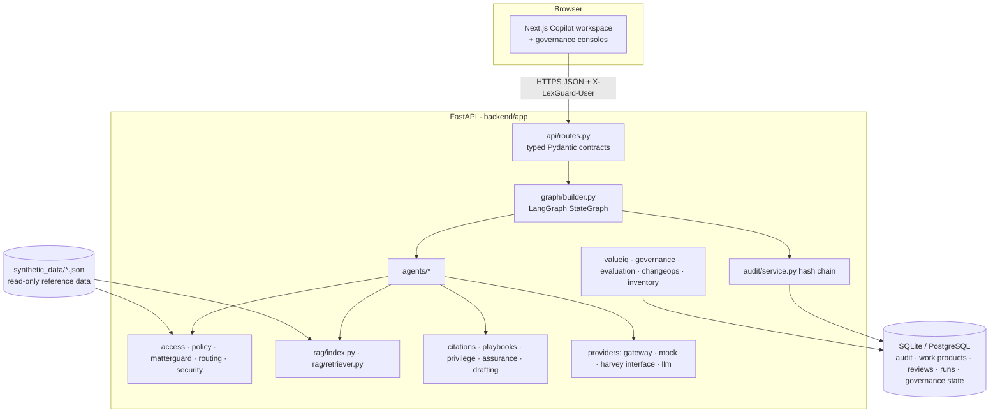
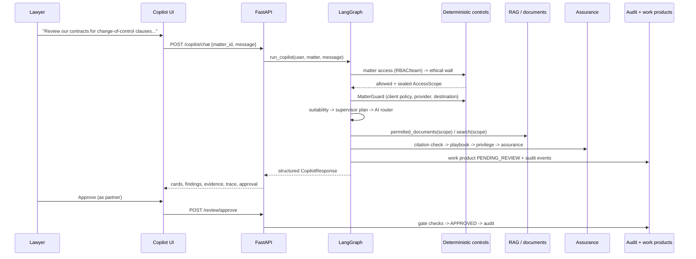
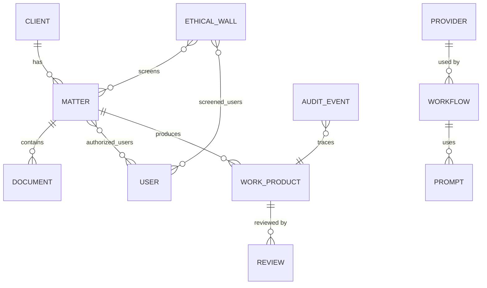

# Architecture

LexGuard separates six responsibilities and never blurs them:

| Responsibility | Component | Can it change permissions? |
|---|---|---|
| User experience | Copilot (Next.js) | No |
| Reasoning and orchestration | LangGraph supervisor + agents | No |
| Evidence and institutional knowledge | Permission-aware RAG | No |
| Permissions, policy, risk, governance, hard controls | Deterministic engines | **Yes - only these** |
| Optional execution | External legal-AI providers (via gateway) | No |
| Consequential decisions | Human lawyer | Approves / rejects |

## System context



## Request lifecycle (Copilot)



## LangGraph state

`backend/app/graph/state.py` defines `LexGuardState` (TypedDict) with: `request_id, user, role, client, matter, task,
intent, documents, matter_access, ethical_wall_status, ai_policy, ai_suitability, risk, routing_decision,
retrieved_sources, findings, citations, playbook_results, privilege_flags, assurance_result, draft, human_review,
approval_status, provider, workflow, cost, latency, audit_events, errors` plus orchestration fields (`plan`,
`plan_index`, `iterations`, `work_product`, `agent_trace`, `graph_path`). List fields that accumulate across nodes
(`agent_trace`, `graph_path`, `errors`, `agents_invoked`, `audit_events`) use `operator.add` reducers.

Non-serialisable services (data store, sealed scope, MatterGuard result, ToolGateway, ProviderGateway) live in a
per-request `RunContext` passed through LangGraph's `config["configurable"]` — never in model-visible state.

## Graph nodes and edges

| Node | Agent / engine | Exits |
|---|---|---|
| `matter_context` | Matter Intake | → access_control |
| `access_control` | RBAC + matter team | denied → `stop_audit`; else → ethical_wall |
| `ethical_wall` | Wall check; creates sealed scope | blocked → `stop_audit`; else → ai_policy |
| `ai_policy` | MatterGuard | AI prohibited → `human_traditional_route`; provider prohibited → `policy_block`; else → suitability |
| `ai_suitability` | Suitability scoring | → supervisor |
| `supervisor` | Plan, prerequisites | needs input → finalize; else → ai_router |
| `ai_router` | Route selection | → human_lawyer / traditional_search / internal_ai / external_ai route |
| `execute_agents` | Bounded loop over plan (iteration limit) | loop / → citation_check / → finalize |
| `citation_check` → `playbook_check` → `privilege_check` → `assurance` → `human_review` | Assurance chain | → finalize |
| `finalize` | ValueIQ estimate, workflow-run record, FINAL_STATUS audit, response composition | END |

Every node is wrapped: deadline check, exception capture into structured `errors`, timing, and trace entries.
Permission errors (tool denied, provider blocked, scope violation) become `BLOCKED`; time budget → `HALTED`.

## Data model



Reference data (users, clients, matters, walls, documents, knowledge, playbooks, providers, workflows, prompts,
golden sets) is read-only JSON. Mutable state (audit, work products, reviews, workflow runs, governance state such as
promoted versions and approved policy changes) is in SQLAlchemy tables; `DATABASE_URL` selects SQLite or PostgreSQL.

## Module map

```
backend/app/
  access/        rbac.py, matter_access.py (AccessScope seal)
  policy/        engine.py (rule set)
  matterguard/   guard.py
  routing/       suitability.py, router.py
  rag/           index.py (partitioned BM25), retriever.py
  documents/     access.py (scoped document access), analysis.py
  citations/     verifier.py
  playbooks/     guard.py
  privilege/     guard.py
  assurance/     pipeline.py
  drafting/      drafter.py
  agents/        core.py, legal.py, assurance.py, registry.py
  graph/         state.py, context.py, builder.py
  copilot/       intent.py, composer.py
  providers/     base.py, mock.py, harvey_adapter.py, registry.py (gateway), llm.py
  security/      tool_gateway.py, injection.py, redaction.py, uploads.py
  governance/    review.py, control_tower.py, use_cases.py
  valueiq/ evaluation/ changeops/ inventory/ audit/ observability/ models/ services/ api/
frontend/
  app/ (14 routes) components/ features/copilot/ hooks/ lib/ types/ __tests__/
```

## Observability

Each request logs one structured JSON event (`copilot_request`) with request ID, user, client, matter, intent, graph
path, agents, tools, retrieval source IDs, provider, policy decision, risk, assurance, human review, latency,
estimated cost and errors. HTTP access logs carry method, path, status and latency. Secrets are redacted by key and by
value pattern before any log or audit write.

## Live mode

`DEMO_MODE=false` + `ANTHROPIC_API_KEY` enables `providers/llm.py` `narrate()`, which may only rephrase the final
deterministic answer, and only when `llm_narration` is an allowed tool for the matter (blocked for clients that
prohibit external AI). It never receives control decisions to make, and its output cannot change status, routing or
approval requirements. Untrusted text is wrapped in `<untrusted_document>` delimiters.
