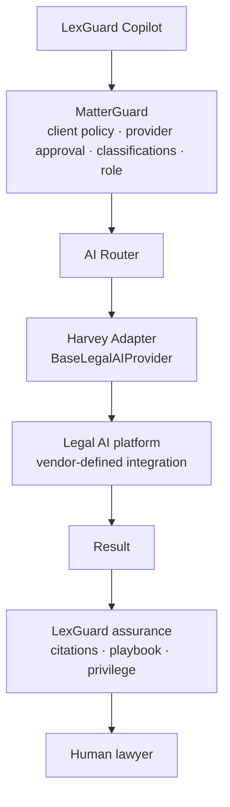

# Harvey Integration (design note)

> **Status: interface only - not integrated.** This repository contains **no** Harvey API calls, endpoints, schemas
> or credentials. `HarveyAdapter` raises `ProviderNotIntegrated` for every method. Nothing here describes Harvey's
> actual API; where an integration would need vendor specifics, this note says so.

## Positioning

LexGuard treats Harvey - like any external legal-AI platform - as a potential **governed execution provider**.
LexGuard does not replicate Harvey's capabilities; it decides *whether* a given matter, task and data set may be sent
to such a provider, *what* may be sent, and *what must happen* to the result before anyone relies on it.

## What exists in this repo

* `backend/app/providers/base.py` - the provider-neutral interface (`analyze_documents`, `research`, `draft`,
  `compare`, `summarize`).
* `backend/app/providers/harvey_adapter.py` - a class implementing the interface whose methods all raise
  `ProviderNotIntegrated`.
* Registry entry `P-HARVEY`: approval `PENDING_DUE_DILIGENCE`, status `NOT_INTEGRATED`, no allowed classifications.
  MatterGuard therefore returns `PROHIBITED` (`POL-PROV-001`) for any request naming it, and the demo shows that
  ("Send these documents to Harvey" is blocked).

## What a real integration would depend on

An actual integration depends on, at minimum:

* **Available enterprise APIs or supported integrations** offered by the vendor to the firm, and their documented
  request/response formats, limits and versioning.
* **Authentication and authorisation** model (e.g. tenant configuration, service identities, token handling) and how
  the firm's identities map to vendor workspaces.
* **Permissions**: whether the vendor workspace can mirror matter teams and ethical walls, or whether LexGuard must be
  the sole gatekeeper (the design assumes LexGuard always gates first).
* **Contractual configuration**: data processing terms, retention, training restrictions, data residency,
  sub-processors, audit rights, and client consent where outside-counsel guidelines require it.
* **Data handling**: which classifications may be sent; redaction or minimisation requirements.

None of these are assumed here.

## Integration plan (when the above are in place)

1. Implement `HarveyAdapter` methods against the vendor's documented interface only; keep vendor specifics inside
   the adapter.
2. Keep secrets in a secret manager / environment, never in code; add redaction patterns for any new token format.
3. Map results into LexGuard's structures (propositions with citations) so the assurance pipeline can verify them;
   unverifiable vendor claims are reported as `UNSUPPORTED`, never silently trusted.
4. Add evaluation golden sets; run baseline vs candidate in the Evaluation Lab; record in the AI Inventory.
5. Update the registry entry (classifications, practices) and move status to `ACTIVE` after approval.
6. Clients must explicitly allow the provider (`allowed_external_providers`) - LexGuard enforces this per matter.
