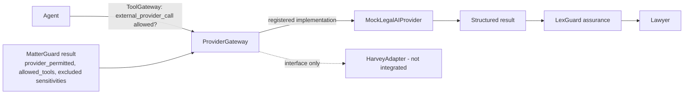

# Provider Integration

LexGuard is provider-neutral. External legal-AI platforms, internal RAG and general copilots are **execution
providers** behind one interface, one registry and one gateway. Providers never decide what they may see.



## Interface (`backend/app/providers/base.py`)

```python
class BaseLegalAIProvider(ABC):
    provider_id: str
    external: bool
    def analyze_documents(self, documents: list[dict], instructions: str) -> dict: ...
    def research(self, question: str, context: list[dict]) -> dict: ...
    def draft(self, draft_type: str, context: list[dict]) -> dict: ...
    def compare(self, a: dict, b: dict) -> dict: ...
    def summarize(self, document: dict) -> dict: ...
```

## Registry (`synthetic_data/governance/providers.json`)

Each provider records: name, type, internal/external, approval status, status, allowed data classifications, practice
restrictions, matter restrictions, capabilities, human-review requirement, owner and notes.

| Provider | Type | External | Approval | Status |
|---|---|---|---|---|
| LexGuard Internal RAG | INTERNAL_RAG | no | APPROVED | ACTIVE |
| Firm Enterprise Copilot | ENTERPRISE_COPILOT | no | APPROVED | ACTIVE (not for privileged; restricted on Matter Beta) |
| Mock Legal AI Platform | EXTERNAL_LEGAL_AI | yes | APPROVED | ACTIVE (local simulation) |
| Harvey (adapter interface) | EXTERNAL_LEGAL_AI | yes | PENDING_DUE_DILIGENCE | NOT_INTEGRATED |
| Legal Research Platform (mock) | LEGAL_RESEARCH_PLATFORM | yes | APPROVED | ACTIVE (public/internal data only) |
| Anthropic Claude (live narration) | LLM | yes | CONDITIONAL | DISABLED_IN_DEMO |

## Gate sequence for every provider call

1. MatterGuard evaluates the request **with** the provider: client policy (`POL-CLIENT-*`), registry
   (`POL-PROV-*`) and role (`POL-RBAC-001`).
2. The AI Router selects `EXTERNAL_LEGAL_AI` only if the provider was permitted.
3. The agent's tool call `external_provider_call` must pass ToolGateway (agent allowlist + MatterGuard tools).
4. `ProviderGateway.invoke` re-checks that MatterGuard permitted *this* provider for *this* request; otherwise
   `ProviderNotPermitted` and a `PROVIDER_BLOCKED` audit event.
5. LexGuard minimises the payload (only active documents within the permitted classifications).
6. The result flows through LexGuard's own assurance pipeline and lawyer approval. Provider output is never trusted
   as verified.

## Adding a provider

1. Implement `BaseLegalAIProvider` in `backend/app/providers/<name>.py` using only documented, contracted APIs.
2. Register it in `_IMPLEMENTATIONS` (`providers/registry.py`) and add a registry entry with approval status
   `PENDING_DUE_DILIGENCE` until security, privacy and contractual review complete.
3. Add golden-set cases and run the Evaluation Lab; record the result in the AI Inventory.
4. Approve the registry entry (approval status `APPROVED`, status `ACTIVE`) and restrict classifications/practices.
5. Client instructions still apply: a client must list the provider in `allowed_external_providers`.
