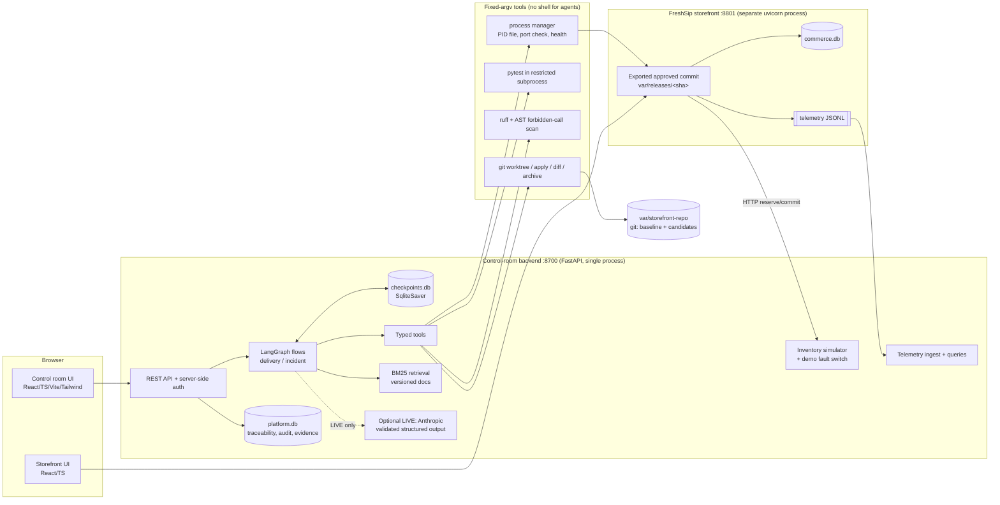
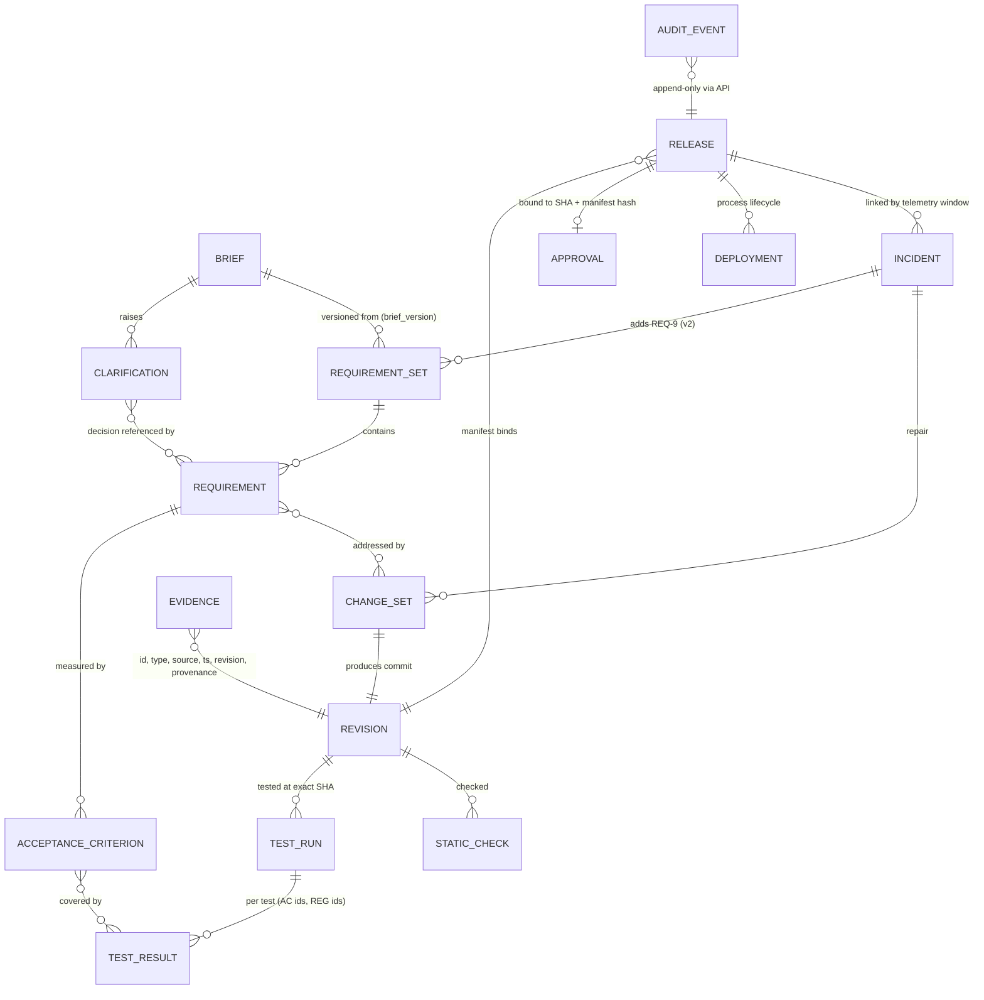

# Architecture

## Components

* **One backend, clear modules.** `services/delivery.py` (runs, decisions, requirements, gates, releases), `tools/inventory_sim.py` (commerce dependency), and `tools/telemetry.py` plus `services/incidents.py` (operations). No microservices.
* **The orchestrator runs independently of the storefront.** The storefront is a separate process started from an exported commit. It survives control-room restarts and is re-adopted through its PID file. If the PID file shows it is gone, the current release is restored.
* **Real deployment.** `tools/deploy.py` stops the previous managed process, refuses a port held by an unmanaged process, starts uvicorn from `var/releases/<sha>`, waits for `/health` to report that exact revision, and records each lifecycle event.

## Delivery and incident flows (LangGraph)

```mermaid
flowchart TD
  subgraph Delivery
    BA[brief_analyst] --> CG{clarification_gate<br/>interrupt}
    CG -->|decisions recorded| RA[requirements_agent]
    CG -->|still open| CG
    RA --> RG{requirements_gate<br/>interrupt}
    RG -->|approved| DA[design_agent] --> IA[implementation_agent<br/>patch 01 in worktree]
    RG -->|not yet| RG
    IA --> QA[qa_agent<br/>pytest on exact revision]
    QA -->|fail, known regression,<br/>attempts left| RP[repair_agent<br/>patch 02] --> QA
    QA -->|fail otherwise| BL[blocked]
    QA -->|pass| RV[review_agent<br/>ruff + scan] --> RC[release_coordinator<br/>gates + manifest]
    RC -->|evidence ready| AG{approval_gate<br/>interrupt}
    RC -->|gaps| BL
    AG -->|deployed| PD[post_deploy_check]
  end
  subgraph Incident
    IN[incident_analyst] --> RU[requirements_update<br/>REQ-9 proposed] --> RG2{requirements_gate}
    RG2 --> RPd[reproduce: suite v2 on released revision<br/>expected to fail] --> RP2[repair_agent<br/>patch 03] --> QA2[qa_agent] --> RV2[review_agent] --> RC2[release_coordinator] --> AG2{approval_gate}
    AG2 --> VF[verify_under_fault] --> FG{fault_gate<br/>interrupt until cleared} --> VA[verify_after_clear]
  end
```

* **Typed shared state** (`agents/nodes.py: FlowState`) carries the run ID, flow, mode, incident ID, revision, base revision, change-set and test-run IDs, last test status, failed regression IDs, repair attempts, release ID, outcome and errors. The authoritative records live in `platform.db`; the graph state holds IDs.
* **Human gates** call `interrupt()` at most once per node execution and loop back to themselves through a conditional edge until the database shows the condition is met. A node re-runs from the top on resume, so gates perform no side effects before waiting.
* **Resume.** State is checkpointed after every node in `checkpoints.db`. A crash (`SDLC_COPILOT_CRASH_ONCE_AT=<node>` in the tests) leaves the run resumable, and Continue re-executes from the last checkpoint. Side-effecting nodes are idempotent: an existing change set for the same patch and base is reused.
* **Bounds.** At most 1 repair attempt per flow, a recursion limit of 60, a per-tool timeout (default 180 s), output caps of 200 kB, and an LLM call budget per run (LIVE).
* **Pause, step mode and Continue.** Pause stops the stream after the current node. Step mode pauses after every node.

## Traceability model

Every evidence row has an ID, type, source, timestamp, revision and provenance. `GET /api/runs/{id}/trace` assembles the chain *brief version → requirement → acceptance criterion → change set → test result → release → incident → repair*. A missing link is reported as a gap (for example `gap: no test evidence`), never hidden.

## Release gates

`delivery.evaluate_gates(run_id, revision)` checks the following deterministically, **for the exact revision**:

| Gate | Rule |
|---|---|
| G1 | Every required clarification has a recorded decision |
| G2 | The current requirement set is approved |
| G3 | The latest test run *on this revision* passed, and its tests hash equals the hash frozen at approval |
| G4 | Every critical acceptance criterion has a passing test in that run, and none failing |
| G5 | `ruff` (platform policy) and the forbidden-call scan both passed on this revision |
| G6 | No open blocking findings |
| G7 | Every regression ID ever recorded for the run (REG-001, REG-002) is present and passing |

**Evidence readiness** (G1–G7) is separate from **deployment authorization**. An approval must quote the current manifest SHA-256. It is accepted only from the `release_approver` role, at most once per release, and only while the candidate head still equals the manifest revision; a new commit invalidates the release. Deploy re-evaluates the gates and checks that the approval is bound to the same revision and hash.

## State machines

Runs: `draft → clarification-needed → requirements-review → requirements-approved → implementing ⇄ testing → awaiting-release-approval → approved → deploying → deployed → (requirements-review | implementing | rolled-back)`, plus `blocked` and `failed`. The exact table is in `backend/app/states.py`. Invalid transitions raise `409 invalid_transition` and are audited.

Releases: `awaiting-approval → approved → deploying → deployed → superseded | rolled-back`, plus `blocked`, `failed` and `invalidated`.

## Storefront revisions

| Stage | Code | Notes |
|---|---|---|
| `v1.0-baseline` | 1.0.0 | No campaign. Inventory calls have a 1.5 s timeout and map failures to 503. Seeded known-good release. |
| `v1.1-campaign-faulty` | 1.1.0 | Patch 01: the campaign. Defect: the free line is not re-validated when the cart is recomputed. The new `reserve_order` call uses `timeout=None`. |
| `v1.1-campaign-fixed` | 1.1.0 | Patch 02: the entitlement is re-derived on every recompute. **This is the first approved release.** It still carries the timeout regression. |
| `v1.2-timeout-repair` | 1.2.0 | Patch 03: reservation goes through the adapter's bounded `_post`, so failures become 503 and the cart is kept. |

The stage trees are only the readable source of the seeded proposals. The platform never copies a stage into a workspace: it applies the generated diffs with `git apply`.
