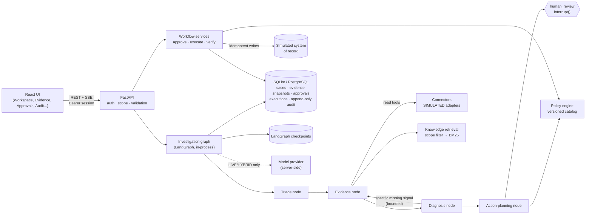
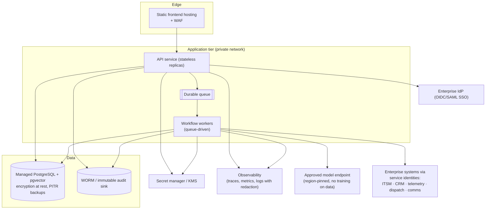

# Architecture

## Prototype (what runs today)

### Node contracts

| Node | Input | Tools (read-only, tenant-scoped) | Output schema | Validation / error strategy |
|---|---|---|---|---|
| Triage | complaint text, prior-contact count | none | `TriageOutput` | Pydantic schema; special requests and prior actions re-derived by rules so a model omission cannot hide them; unknown actions dropped |
| Evidence | case, triage output, requested signals | `account_context`, `support_history`, `incident_search`, `diagnostics`, `peer_health`, `on_demand_line_test`, `knowledge_search` | `EvidenceBundle` (persisted as an immutable snapshot) | Support/oppose tags computed from `diagnostic_rules.json`; injection-like text quarantined; LIVE model may only propose knowledge queries |
| Diagnosis | evidence snapshot | none | `DiagnosisOutput` | LIVE citations must exist and carry the rule tag for the category; sufficiency recomputed by rules; disagreement with rules is recorded and rules win |
| Action planning | diagnosis, snapshot, triage | policy engine | `RecommendationDraft` | Only policy-permitted actions; LIVE model may choose among them and write purpose/uncertainty text, never payloads, roles or approvals |

Nodes communicate only through the shared `CaseWorkflowState` (ids and small summaries; raw records stay in the
database and are referenced by snapshot id). There is no agent-to-agent network protocol: A2A or MCP would be
future adapters only if a real interoperability requirement appears, and would go through the same authorization
and input validation as the REST tools.

### Routing and limits

- Diagnosis routes back to Evidence only when it names a specific missing signal (today:
  `fresh_line_diagnostics`), at most `MAX_EVIDENCE_ITERATIONS` times.
- Every node checks a wall-clock budget (`MAX_INVESTIGATION_SECONDS`) and the per-case token budget
  (`LLM_CASE_TOKEN_BUDGET`); exhaustion escalates with the evidence collected so far.
- Unexpected errors move the case to `FAILED` with the error code; nothing is reported as success.

### State machine

`NEW → TRIAGED → COLLECTING_EVIDENCE → ASSESSING → RECOMMENDATION_READY → AWAITING_APPROVAL → APPROVED →
EXECUTING → VERIFYING → RESOLVED | MONITORING | ESCALATED`, plus `NEEDS_INFORMATION`, `REJECTED`, `CANCELLED`,
`FAILED`. Legal transitions and their prerequisites live in `backend/app/policies/state_machine.py` and are
served at `GET /api/system`. Every transition is a compare-and-set on `(status, version)` committed in the same
transaction as its audit event, so the UI's status stream always reflects persisted state.

Notable rules: `EXECUTING` can never go straight to `RESOLVED` (an API success is not recovery); a lost write
response keeps the case in `EXECUTING` with execution status `unknown` until it is reconciled.

### Approvals

An approval binds `case_id`, `action_type`, `payload_hash` (SHA-256 of canonical JSON), `policy_version`,
`evidence_snapshot_id` and `expires_at`. Decisions are compare-and-set on the approval row (no double decision);
the reviewer must submit the payload hash they saw. Execution re-checks the approval state, expiry, payload hash
against the stored payload, policy version, and the executor's role, then consumes the approval and creates the
execution row in one transaction (unique on approval id and on `(case, Idempotency-Key)`).

The graph waits at `human_review` via `interrupt()`; no HTTP request is held open. A decision resumes the thread
with `Command(resume=...)`. Waiting cases are not treated as stalled jobs on restart.

### Restart and resume

Investigations run in a bounded thread pool (2 workers). The case row records the active job and thread id. On
startup `recover_incomplete_jobs()` resumes any thread whose worker stopped, from its last checkpoint (tested by
crashing the diagnosis node and resuming in a fresh graph/checkpointer instance).

### Retrieval

Documents are chunked by `##` section with character offsets, version, product, tenant scope and allowed roles.
Tenant filtering happens in SQL and role filtering before scoring; BM25 then ranks with authority as tie-break
(policy > runbook > guide). Semantic retrieval is not implemented; the PostgreSQL image includes pgvector so a
future embedding provider can add it without changing the scope filter.

## Production reference architecture (design only — not deployed)

Key differences from the prototype: SSO with server-validated tokens instead of persona login; a durable queue
instead of an in-process thread pool; audit events also streamed to an immutable store; per-connector service
identities with least privilege; region-pinned model, embedding, storage, log and backup locations (see
[security.md](security.md)); blue/green API deploys with migrations run as a separate step.

### Backup and restore (prototype procedure)

- SQLite: stop the API, copy `backend/telecomresolve.db` and `backend/checkpoints.db` together.
- PostgreSQL: `pg_dump -Fc telecomresolve > tr.dump`; restore with `pg_restore -d telecomresolve tr.dump`.
  Domain tables and LangGraph checkpoint tables live in the same database so one dump is consistent.
- After a restore, run `alembic upgrade head`, start the API, and check `GET /api/cases/{id}/audit/replay`
  reports `hash_chain_valid: true` for a sample of cases.
- Checkpoint recovery was tested locally (`backend/tests/test_checkpoint_recovery.py`); a full backup/restore
  drill was **not** performed in this build.
